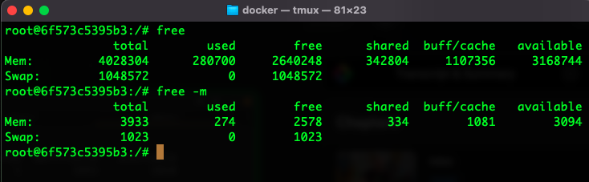
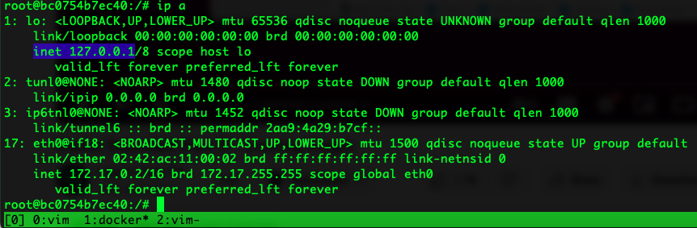
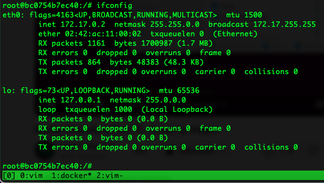
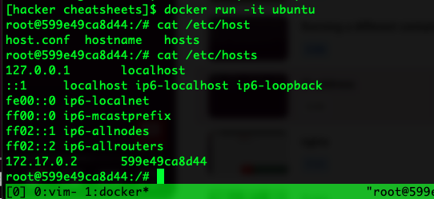

# Research tools
1. IDAPro
- [Download the free version from here](https://hex-rays.com/ida-free/)
- If in server, install it following this [repo](https://github.com/AngelKitty/IDA7.0/tree/master)
    - to install from source, if having dependency issues
    ```
        git clone https://github.com/AngelKitty/IDA7.0.git
        cd IDA7.0/
        chmod +x idafree70_linux.run
        ./idafree70_linux.run
    ```
    - The ida64 will be present inside ida<version> of home dir `~/ida<version>`
    - Now, link it `sudo ln -s /opt/idafree-7.0/ida64 /usr/bin`

# Resources
Follow this post: [https://www.linkedin.com/posts/dr-faheem-ullah_10-free-mit-courses-%3F-%3F%3F%3F%3F%3F%3F%3F%3F%3F%3F%3F%3F-activity-7118167435253346304-YFgk?utm_source=share&utm_medium=member_desktop](https://www.linkedin.com/posts/dr-faheem-ullah_10-free-mit-courses-%3F-%3F%3F%3F%3F%3F%3F%3F%3F%3F%3F%3F%3F-activity-7118167435253346304-YFgk?utm_source=share&utm_medium=member_desktop)

# My cheatsheets
If there is any difficult piece of code then draw a **TRACE TABLE**

1. `tmux` notes are present in the tmux folder 

2. `vim` notes are present in the vim folder

3. Use `zsh` ubuntu to configure the shell

## General cmd's
**Memory and swap usuage**
```
# usused ram is wasted ram. If something is in memory, it can be retrieved faster than it could be retrieved from the disk. That's why, a linux system cache memory as much as possible so that it can be retrieved faster. 

free -m # It will show how many free space do I have. 
# -m shows the result in megabytes

# under available field, the memory is available but it's used whenever a process needs it.
# swap is emergency memory. If you ended up using all your memory then memory will be used from swap. It's kind of like car insurance. 

# swappiness should be 60, it's the happy median
$ sysctl vm.swappiness
vm.swappiness = 60
```


**Copy folder using `scp`**
```
scp -r CPS-VVI-LOGS-DATA/ raihan@callisto.cs.utah.edu:/home/raihan  # to copy folder to a server
scp ROBOPro@x.x.x.x:~/C-Program/<file-name.txt> . # to copy a file from another server
```

**ip address**
ubuntu
```
ip a # get the ip from inet
# a stands for address
```
If ip not found then install route2 - `sudo apt install iproute2`


Or, use `ifconfig`, if it's not found then install net-tools - `sudo install net-tools`


Or, see the hosts file,
```
cat /etc/hosts
```


mac
```
ifconfig 
```

**Deleted files of ubuntu with `rm -rf` is present in following dir,**
```
/.local/share/Trash/files
```

**Search a pkg in ubuntu**
```
apt search ripgrep
```
Or, search in the cache,
```
apt-cache search ripgrep
```

**Find the changes made on a directory**
```
find ./sysdig/ -type f -exec stat --format="%Y %n" {} \; | sort -n 
```
#### TRY TO AVOID THE `PKILL` COMMAND AS MUCH AS POSSIBLE. RAN INTO PROBLEMS AFTER EXECUTING IT COUPLE OF TIMES.
**Vim hangs or stops**
```
ps auxw | grep vim
pkill -9 vim ## TRY TO AVOID THIS COMMAND AS MUCH AS POSSIBLE. RAN INTO PROBLEMS AFTER EXECUTING IT COUPLE OF TIMES.
```

**To find size of a dir, do this `du -sh <folder name>`**
```
du -sh grpc/
```


**Find a file in a dir and it's sub-dirs**
```
find . -name "ProtobufConfig.cmake"
```

**Python3.7**
If I am using `python3.7` then I should install `python3.7-dev`,
```
sudo apt-get install libpython3.7-dev
```

Then the `netfilterqueue` will be installed,
```
pip3 install netfilterqueue
```

#### nmap scan networks
```
nmap <ip> # it will show the port and it's status
nmap -sV <ip> # it will show the port with service and version
nmap -A <ip> # this -A option stands for 'Arrange' will give the os info also
nmap <ip/subnet> # scans the subnet also 
time nmap <ip> # this will show the time
time nmap -T5 <ip> # this will make the scan faster. "T0 - T5" are the timing modes of nmap and T5 is fastest
```

# General guidelines

### Git readme
Create a collapsible section
```
<details open>

  <summary>click to collapse</summary>

  this one starts expanded because of the "open"

</details>
```

### Under Linux, the version of the system-wide `cmake` can often be too old.

Install more recent version from the cmake releases,
```
wget -q -O cmake-linux.sh https://github.com/Kitware/CMake/releases/download/v3.19.6/cmake-3.19.6-Linux-x86_64.sh
sh cmake-linux.sh -- --skip-license --prefix=$MY_INSTALL_DIR
rm cmake-linux.sh
```
I installed it and copied it inside the `/usr/local/bin` dir but then figured the `cmake --version` was not able to find it though the `/usr/local/bin` is present in the `echo $PATH`. So, just linked it to `/usr/bin`,
```
sudo ln -s /usr/local/bin/cmake /usr/bin/cmake
```

## git grep
1. To search only within a file or, include only 1 file
```
git grep "pattern" -- ':*.py' # :"*.py" also works
```
2. To exclude a file
```
git grep "pattern" -- ':!*.pdf'
```
3. To exclude multiple files
```
git grep "t #*" -- ':!*.pdf' ':!*.dot' ':!*.png'
```

## grep
1. grep a range of numbers from a file
```
cat out | grep -E "([6-9][0-9]|100)" 
```
2. Then grep another string
```
cat out | grep -E "([6-9][0-9]|100)" | grep "v"
```
3. grep from 60-150 and see if there is another string
```
cat out | grep -E "([6-9][0-9]$|1[0-4][0-9]|150$)" | grep "v"
```

## Install grpc
**Install python3 version > 3.7**
In ubuntu 18.04, tried to install python 3.9 but didn't find the pkg, so, tried using this `ppa`,
```
sudo add-apt-repository ppa:deadsnakes/ppa
```
Now, do following,
```
sudo apt-get update
sudo apt-get install python3.9
sudo update-alternatives --install /usr/bin/python3 python3 /usr/bin/python3.9 1  ## update the default
```
**Sometimes getting a Red Minus button saying "A problem occurred when checking for updates"**
Do this to solve this problem, this is related to python,
```
# remove python3.9 if installed, for ubuntu 18.04
sudo apt-get remove python3.9
sudo apt autoremove
sudo apt-get --reinstall install python3-minimal
sudo rm /var/cache/apt/*.bin
sudo apt-get update && sudo apt-get upgrade
```

**Install bazel, which is required for protobuf, which is required for grpc**
if `sudo apt-get install g++ git bazel` doesn't work, then just `curl` it and copy to local bin,
```
curl -Lo bazelisk https://github.com/bazelbuild/bazelisk/releases/latest/download/bazelisk-linux-amd64
chmod +x bazelisk
sudo mv bazelisk /usr/local/bin/bazel
```

**Installing protobuf**
If `sudo apt  install protobuf-compiler` doesn't install the necessary pkg's like still getting this error for grpc,
```
CMake Error at /home/raihan/grpc/examples/cpp/cmake/common.cmake:99 (find_package):
  Could not find a package configuration file provided by "Protobuf" with any
  of the following names:

    ProtobufConfig.cmake
    protobuf-config.cmake

  Add the installation prefix of "Protobuf" to CMAKE_PREFIX_PATH or set
  "Protobuf_DIR" to a directory containing one of the above files.  If
  "Protobuf" provides a separate development package or SDK, be sure it has
  been installed.
Call Stack (most recent call first):
  CMakeLists.txt:24 (include)
```
Then install the protobuf in following way,
```
git clone https://github.com/protocolbuffers/protobuf.git
cd protobuf
git submodule update --init --recursive
bazel build :protoc :protobuf
cp bazel-bin/protoc /usr/local/bin ## check if it's required to copy it
```
But this will not solve that problem because it will not find the `ProtobufConfig.cmake file or, `protobuf-config.cmake`.  But inside the protobuf dir there will be a cmake dir. That will look like following, the pic is taken after I run the cmd's,


Run these cmd's,
```
cd ~/protobuf/cmake/
mkdir build
cd build
cmake ../..
make
sudo make install
```

[Follow these guidlines](https://grpc.io/docs/languages/cpp/quickstart/)
And don't forget to run the `make` and `make install` for grpc after installing the protobuf. The protobuf will also need the grpc to install.
**The `arm-toolchain.cmake` is the file that is required for arm64 bit compilation, it uses the toolchain that comes with the testbed.** 


## Tryhackme opnevpn
The ovpn file requires openvpn version greater than 2.5. And ubuntu-18 installs openvpn 2.4.4 by default.
So, download it from the official site: [https://openvpn.net/community-downloads/](https://openvpn.net/community-downloads/)
And install this `lzo` with some other deps: `sudo apt install cmake libssl-dev liblzo2-dev libpam0g-dev`
Now, follow readme of that file.

After running this line `sudo openvpn /path-to-file/file-name.ovpn`,
I will see following,
```
...
...
2023-08-21 18:03:13 WARNING: this configuration may cache passwords in memory -- use the auth-nocache option to prevent this
2023-08-21 18:03:13 Initialization Sequence Completed
```
Now, goto this page [https://tryhackme.com/access](https://tryhackme.com/access). If connection is done properly then there will be a tick beside the network info/openvpn access details.
Now, start the machine here: [https://tryhackme.com/room/openvpn](https://tryhackme.com/room/openvpn), then you will see the ip. [This machine is for openvpn connection only, for other room, I should start that machine]

**Install gobuster**
If I run `go install` then it will install inside the home directory but if I export the GOBIN to my desired directory then I can install any executables in my desired directory,
```
export GOBIN=$HOME/.local/bin
# probably need to move the go folder from home directory.
```


## Cross-compile auditd for arm32

```
export PATH=export PATH=~/Downloads/gcc-linaro-7.2.1-2017.11-x86_64_arm-linux-gnueabihf/bin:$PATH
export CC=arm-linux-gnueabihf-gcc
git clone git@github.com:linux-audit/audit-userspace.git
cd audit-userspace
./autogen.sh
./configure --host=arm-linux-gnueabihf --with-python3=yes --enable-gssapi-krb5=yes --with-arm --with-aarch64 --with-libcap-ng=yes --without-golang --with-io_uring
make

# now copy the files to auditd
scp -r <compiled_files> user@arm32_device_ip:/path/on/device
```

If getting the `subdir-objects` error,
```
auparse/Makefile.am:576: but option 'subdir-objects' is disabled
bindings/python/python3/Makefile.am:30: warning: source file '$(top_srcdir)/bindings/python/auparse_python.c' is in a subdirectory,
bindings/python/python3/Makefile.am:30: but option 'subdir-objects' is disabled  #### This problem will be solved
bindings/swig/src/Makefile.am:25: warning: variable 'SWIG_SOURCES' is defined but no program or
bindings/swig/src/Makefile.am:25: library has 'SWIG' as canonical name (possible typo)
lib/Makefile.am:243: warning: gen_ftypetabs_h_SOURCES multiply defined in condition TRUE ...
lib/Makefile.am:163: ... 'gen_ftypetabs_h_SOURCES' previously defined here
lib/Makefile.am:244: warning: gen_ftypetabs_h_CFLAGS multiply defined in condition TRUE ...
lib/Makefile.am:164: ... 'gen_ftypetabs_h_CFLAGS' previously defined here
autoreconf: automake failed with exit status: 1
```
In the `condifugre.ac` file, add following,
```
AM_INIT_AUTOMAKE([subdir-objects]){ pkgs ? import <nixpkgs> {} }:
  pkgs.mkShell {
    # nativeBuildInputs is usually what you want -- tools you need to run
    nativeBuildInputs = with pkgs; [ ripgrep neovim git ];
}

```


## Nix configuration for cross-compiling
simple shell.nix
```
{ pkgs ? import <nixpkgs> {} }:
  pkgs.mkShell {
    # nativeBuildInputs is usually what you want -- tools you need to run
    nativeBuildInputs = with pkgs; [ ripgrep neovim git ];
}
```

**shell.nix for cross-compilation**
```
{ pkgs ? import <nixpkgs> {} }:
  pkgs.pkgsCross.aarch64-multiplatform.mkShell {
    # nativeBuildInputs is usually what you want -- tools you need to run
    nativeBuildInputs = with pkgs; [ ripgrep neovim git gcc autoconf automake libtool gnumake go python3 swig ];
    LDAP = pkgs.openldap;  # Corrected typo: changed LADP to LDAP
}

```
To configure auditd,
1. Clone the audit-userspace
2. run `autogen.sh`
3. run `./configure --host=aarch64-linux-gnu --with-python3=yes --enable-gssapi-krb5=yes --with-libcap-ng=yes --without-golang --with-io_uring`


Now, at this error,
```
checking for lber.h... no
checking for ber_free in -llber... no
configure: error: zos remote support was requested but the openldap library was not found
```

#### clang++-14 common error
 - Solution: install this dependency `sudo apt install libstdc++-8-dev`

`lstdc++` not found.
```
End of search list.                                                                                                                                                                                                
 "/usr/bin/ld" -pie -z relro --hash-style=gnu --build-id --eh-frame-hdr -m elf_x86_64 -dynamic-linker /lib64/ld-linux-x86-64.so.2 -o p /usr/lib/x86_64-linux-gnu/Scrt1.o /usr/lib/x86_64-linux-gnu/crti.o /usr/bin/
 ../lib/gcc/x86_64-linux-gnu/8/crtbeginS.o -L/usr/include/x86_64-linux-gnu/c++/7 -L/usr/bin/../lib/gcc/x86_64-linux-gnu/8 -L/lib/x86_64-linux-gnu -L/lib/../lib64 -L/usr/lib/x86_64-linux-gnu -L/lib -L/usr/lib /tmp
 /publisher-c00099.o -lstdc++ -lm -lgcc_s -lgcc -lc -lgcc_s -lgcc /usr/bin/../lib/gcc/x86_64-linux-gnu/8/crtendS.o /usr/lib/x86_64-linux-gnu/crtn.o                                                                 
 /usr/bin/ld: cannot find -lstdc++                                                                                                                                                                                  
 clang: error: linker command failed with exit code 1 (use -v to see invocation)  
 ```

 `c++config` or, `iostream` not found
 ```
/usr/include/c++/7/iostream:38:10: fatal error: 'bits/c++config.h' file not found                                                                                                                                  
#include <bits/c++config.h>                                                                                                                                                                                        
         ^~~~~~~~~~~~~~~~~~                                                                                                                                                                                        
1 error generated.       
```

 - Install the deps and change makefile not to use the deps
 ```
 sudo apt-get install libsdl2-dev libopencv-core-dev libopencv-videoio-dev libopencv-imgcodecs-dev libopencv-imgproc-dev libjsoncpp-dev
 ```

Deps,
```
/usr/bin/ld: cannot find -lSDLWidgetsLib                                                                                                                                                                           
/usr/bin/ld: cannot find -lopencv_core                                                                                                                                                                             
/usr/bin/ld: cannot find -lopencv_videoio                                                                                                                                                                          
/usr/bin/ld: cannot find -lopencv_imgcodecs                                                                                                                                                                        
/usr/bin/ld: cannot find -lopencv_imgproc                                                                                                                                                                          
/usr/bin/ld: cannot find -ljsoncpp
```

But this will not have `libSDLWidgetsLib`,
```
/usr/bin/ld: cannot find -lSDLWidgetsLib
clang: error: linker command failed with exit code 1 (use -v to see invocation)
```
