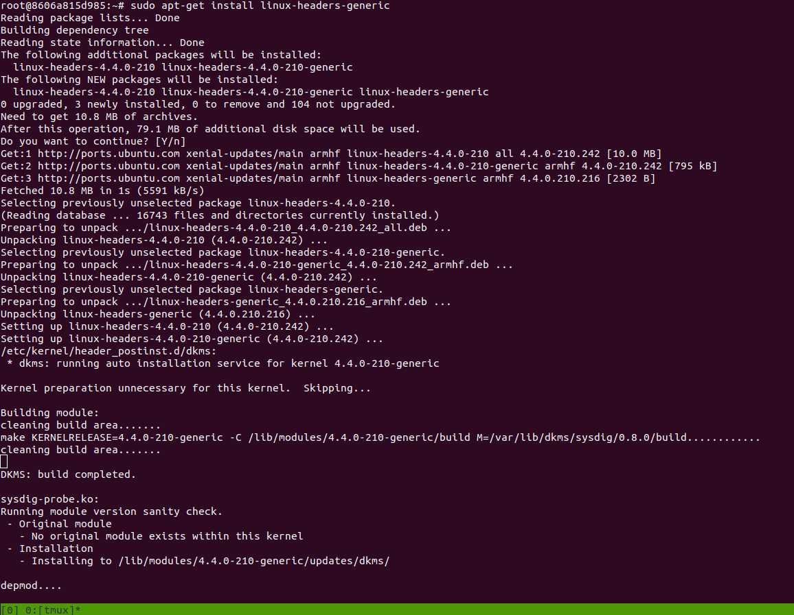

# All auditd and sysdig usage
Install auditd `sudo apt install auditd`
To run just type this `auditd -n`

You don't need `auditd` for `sysdig`
Install `sysdig`,
```
sudo apt update
sudo apt install software-properties-common # this should be present. It is required for add-apt-repository

# sudo add-apt-repository -y ppa:devel-k/sysdig # this or following one
sudo add-apt-repository ppa:eugenesan/ppa
sudo apt install sysdig
sysdig --version
```

### Run sysdig
```
sudo sysdig
sudo sysdig -w output.scap #Capture Events to a File
sudo sysdig evt.type=open or evt.type=write # Filtering Events
## analyze the captured data using tools like csysdig (a curses-based interface) or sysdig-inspect
sudo csysdig -r output.scap # View Captured Events
```

#### Running sysdig inside 32bit/image docker container
If getting errors like following,
```
root@0df6b496736d:~# sudo sysdig -w output.scap
Unable to load the driver
error opening device /dev/sysdig0. Make sure you have root credentials and that the sysdig-probe module is loaded.
root@0df6b496736d:~# sudo sysdig
Unable to load the driver
error opening device /dev/sysdig0. Make sure you have root credentials and that the sysdig-probe module is loaded.
root@0df6b496736d:~# sudo sysdig -w output.scap
Unable to load the driver
error opening device /dev/sysdig0. Make sure you have root credentials and that the sysdig-probe module is loaded.
root@0df6b496736d:~#  sysdig -w output.scap
Unable to load the driver
error opening device /dev/sysdig0. Make sure you have root credentials and that the sysdig-probe module is loaded.
root@0df6b496736d:~# sudo modprobe sysdig-probe
modprobe: ERROR: ../libkmod/libkmod.c:586 kmod_search_moddep() could not open moddep file '/lib/modules/5.15.49-linuxkit/modules.dep.bin'
modprobe: FATAL: Module sysdig-probe not found in directory /lib/modules/5.15.49-linuxkit
root@0df6b496736d:~# 
```

Run this,
```
sudo modprobe sysdig-probe
```

Still getting the same error, Install headers,
```
sudo apt-get install linux-headers-KERNEL_VERSION sysdig-dkms
```

I installed the linux headers and it installed the sysdig modules by default,
Just run this,
```
sudo apt-get install linux-headers-generic
```
The `sysdig-dkms` are installed,
```
Kernel preparation unnecessary for this kernel.  Skipping...

Building module:
cleaning build area.......
make KERNELRELEASE=4.4.0-210-generic -C /lib/modules/4.4.0-210-generic/build M=/var/lib/dkms/sysdig/0.8.0/build............
cleaning build area.......

DKMS: build completed.
```


But the `sysdig-probe` is not there,
```
root@8606a815d985:/lib/modules# sysdig                                                                                                                                                                             
Unable to load the driver                                                                                                                                                                                          
error opening device /dev/sysdig0. Make sure you have root credentials and that the sysdig-probe module is loaded.  
root@8606a815d985:~# sudo modprobe sysdig-probe -v
modprobe: ERROR: ../libkmod/libkmod.c:586 kmod_search_moddep() could not open moddep file '/lib/modules/5.4.0-150-generic/modules.dep.bin'
modprobe: FATAL: Module sysdig-probe not found in directory /lib/modules/5.4.0-150-generic

root@8606a815d985:/lib/modules# ls
4.4.0-210-generic
root@8606a815d985:/lib/modules# 
```


### Start sysdig inside host machine
#### with docker
```
sudo docker run --rm -i -t --privileged --net=host \
    -v /var/run/docker.sock:/host/var/run/docker.sock \
    -v /dev:/host/dev \
    -v /proc:/host/proc:ro \
    -v /boot:/host/boot:ro \
    -v /src:/src \
    -v /lib/modules:/host/lib/modules:ro \
    -v /usr:/host/usr:ro \
    -v /etc:/host/etc:ro \
    docker.io/sysdig/sysdig
```

The above command will start a container with sysdig. Now, do following to follow the commands,
```
sudo apt update
sudo apt install sysdig
```

Follow this tutorial to [install.](https://github.com/draios/sysdig/wiki/How-to-Install-Sysdig-for-Linux)

[Automatic Installation](https://github.com/draios/sysdig/wiki/How-to-Install-Sysdig-for-Linux#user-content-automatic-installation)

[Manual Installation](https://github.com/draios/sysdig/wiki/How-to-Install-Sysdig-for-Linux#user-content-manual-installation)

Sometimes while building the `sysdig` for a different architecture. I might need to build the probe-builder specifically for that architechture. 

[Follow this to build the probe-builder](https://github.com/draios/probe-builder)

The only problem is the [kernel headers requirement](https://github.com/draios/probe-builder#downloading-kernel-packages). For arm32 bit, i might need to build the kernel headers.
Other options,
1. Running my arm32 image and install auditd
2. This auditd will not change anything at system-level. So, copy the following files in the target controller and then it will create audit logs,
    i. /etc/aud*
    ii. /sbin/aud*
    iii. /var/log/audit/

[Build from Source](https://github.com/draios/sysdig/wiki/How-to-Install-Sysdig-from-the-Source-Code)
