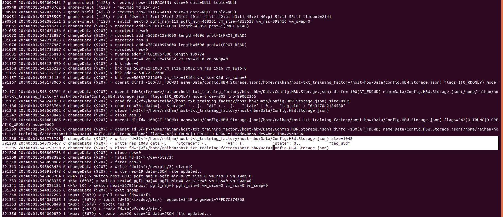

## check following logs
The provided logs do not explicitly confirm whether the file has been written. They indicate the file's access permissions for different operations (read, write, and execute) but do not provide information about the content modification itself.

```
## system call to check the status
127749 12:04:19.101066179 5 pool (22827) < lstat res=0 path=/home/raihan/host-txt_training_factory/host-hbw/Data/Config.HBW.Storage.json  ## checks the status of the file
```
...
```
127830 12:04:19.101300825 5 pool (22827) > access mode=4(R_OK) ## checks if the file is readable
127831 12:04:19.101306921 5 pool (22827) < access res=0 name=/home/raihan/host-txt_training_factory/host-hbw/Data/Config.HBW.Storage.json  ## confirms the file is readable
127832 12:04:19.101310442 5 pool (22827) > access mode=2(W_OK)  ## checks if the file is writable
127833 12:04:19.101313793 5 pool (22827) < access res=0 name=/home/raihan/host-txt_training_factory/host-hbw/Data/Config.HBW.Storage.json  ## confirms the file is writeable
127834 12:04:19.101316963 5 pool (22827) > access mode=1(X_OK)  ## checks if the file is executable
127835 12:04:19.101320381 5 pool (22827) < access res=-13(EACCES) name=/home/raihan/host-txt_training_factory/host-hbw/Data/Config.HBW.Storage.json   ## confirms the file is not executable
127836 12:04:19.101337383 10 <NA> (0) > switch next=4446(gnome-shell) pgft_maj=0 pgft_min=0 vm_size=0 vm_rss=0 vm_swap=0 
```


## Sysdig cmds
```
sudo sysdig -w out.scap
csysdig -r out.scap # to read the file
sudo sysdig -A -w out.scap "fd.type=file and evt.type=write"
sudo sysdig -A "evt.type=open or evt.type=write"
```
**System Sysdig didn't work properly**

# Sysdig worked properly with docker
After running it inside docker, I was able to see all the write to the `Config.HBW.Storage.json` file.
Run it with [docker](https://github.com/draios/sysdig#getting-started)
```
sudo docker run --rm -i -t --privileged --net=host \
    -v /var/run/docker.sock:/host/var/run/docker.sock \
    -v /dev:/host/dev \
    -v /proc:/host/proc:ro \
    -v /boot:/host/boot:ro \
    -v /src:/src \
    -v /lib/modules:/host/lib/modules:ro \
    -v /usr:/host/usr:ro \
    -v /etc:/host/etc:ro \
    docker.io/sysdig/sysdig
```

Now, just run `sysdig` or `csysdig`. 
Currently, the file `docker-sysdig/sysdig5.2` contains the writes to the file.


This file is present inside this folder `/home/raihan/sysdig-logs/docker-sysdig/sysdig5.2`

## Created sysdig docker image - not working
Now, run the sysdig docker image with `--privileged`, like following,
```
sudo docker run -it --privileged --cap-add=SYS_ADMIN --cap-add=SYS_MODULE r/sysdig:1.0
```

## Result after running the docker
After running `sysdig` with permission.
```
(base) ┌─[raihan@raihan-XPS-8940]─[~/host-txt_training_factory/host-hbw]
└──╼ $g++ changeData.cpp -o changeData -I ~/vcpkg/installed/x64-linux/include/
(base) ┌─[raihan@raihan-XPS-8940]─[~/host-txt_training_factory/host-hbw]
└──╼ $ls
a.out       changeData.cpp  hbw-exe     Makefile  README.md                         TxtHighBayWarehouse.cpp  TxtHighBayWarehouseRun.cpp      TxtHighBayWarehouseStorage.h
changeData  Data            hbw-output  pics      TxtHighBayWarehouseCalibData.cpp  TxtHighBayWarehouse.h    TxtHighBayWarehouseStorage.cpp
(base) ┌─[raihan@raihan-XPS-8940]─[~/host-txt_training_factory/host-hbw]
└──╼ $./changeData
JSON file updated.
(base) ┌─[raihan@raihan-XPS-8940]─[~/host-txt_training_factory/host-hbw]
└──╼ $vim Data/Config.HBW.Storage.json
```

### With `changeData.cpp` file
I got this,



```
## Using the openat system call, it opens the file `Config.HBW.Storage.json` with the file descriptor relative to working directory `dirfd=-100(AT_FDCWD)`
591167 20:40:01.543178060 6 changeData (9207) > openat dirfd=-100(AT_FDCWD) name=Data/Config.HBW.Storage.json(/home/raihan/host-txt_training_factory/host-hbw/Data/Config.HBW.Storage.json) flags=1(O_RDONLY) mode=0

## This is specifying a specific file descriptor
591171 20:40:01.543193761 6 changeData (9207) < openat fd=3(<f>/home/raihan/host-txt_training_factory/host-hbw/Data/Config.HBW.Storage.json) dirfd=-100(AT_FDCWD) name=Data/Config.HBW.Storage.json(/home/raihan/host-txt_training_factory/host-hbw/Data/Config.HBW.Storage.json) flags=1(O_RDONLY) mode=0 dev=802 ino=29002365

## This part is reading the data with file descriptor 3 and closing the data
591181 20:40:01.543241030 6 changeData (9207) > read fd=3(<f>/home/raihan/host-txt_training_factory/host-hbw/Data/Config.HBW.Storage.json) size=8191
591186 20:40:01.543258706 6 changeData (9207) < read res=761 data={. "Storage" : . {.  "A1" : .  {.   "state" : 0,.   "tag_uid" : "043470a2186580"
591246 20:40:01.543569002 6 changeData (9207) > close fd=3(<f>/home/raihan/host-txt_training_factory/host-hbw/Data/Config.HBW.Storage.json)
591247 20:40:01.543570845 6 changeData (9207) < close res=0

## Opening the data and also setting the file descriptor to 3
591254 20:40:01.543601685 6 changeData (9207) > openat dirfd=-100(AT_FDCWD) name=Data/Config.HBW.Storage.json(/home/raihan/host-txt_training_factory/host-hbw/Data/Config.HBW.Storage.json) flags=262(O_TRUNC|O_CREAT|O_WRONLY) mode=0666
591269 20:40:01.543675782 6 changeData (9207) < openat fd=3(<f>/home/raihan/host-txt_training_factory/host-hbw/Data/Config.HBW.Storage.json) dirfd=-100(AT_FDCWD) name=Data/Config.HBW.Storage.json(/home/raihan/host-txt_training_factory/host-hbw/Data/Config.HBW.Storage.json) flags=262(O_TRUNC|O_CREAT|O_WRONLY) mode=0666 dev=802 ino=29002365

## writing the data to the file
591288 20:40:01.543773793 6 changeData (9207) > write fd=3(<f>/home/raihan/host-txt_training_factory/host-hbw/Data/Config.HBW.Storage.json) size=1048
## We can also see the data written to the file
591293 20:40:01.543796467 6 changeData (9207) < write res=1048 data={.    "Storage": {.        "A1": {.            "state": 0,.            "tag_uid"

## closing the file
591295 20:40:01.543799720 6 changeData (9207) > close fd=3(<f>/home/raihan/host-txt_training_factory/host-hbw/Data/Config.HBW.Storage.json)
591296 20:40:01.543800733 6 changeData (9207) < close res=0
```

### After running mqtt
At first, while loading, I sent a random data.

[sysdig3-mqtt-random](pics/sysdig3-mqtt1.png)

After that, I sent mqtt command to call `fetchContainer` function and eventually change the data.

[sysdig3-mqtt-published-data](pics/sysdig3-mqtt4pub.png)

Then the storage was read again.

[sysdig3-mqtt-file-read](pics/sysdig3-mqtt2read.png)

Then, the file was changed.

[sysdig3-mqtt-file-written](pics/sysdig3-mqtt3write.png)


#### Done again
[update with new pics]
