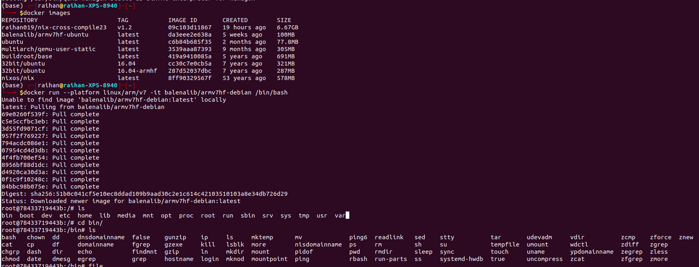
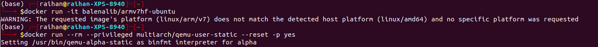
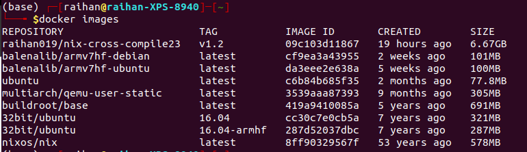
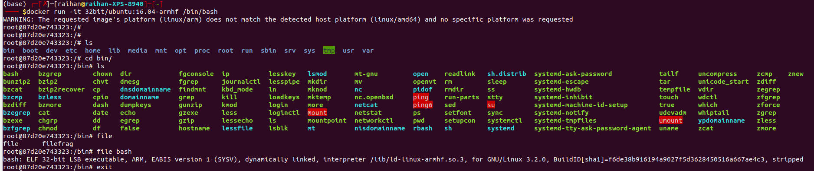
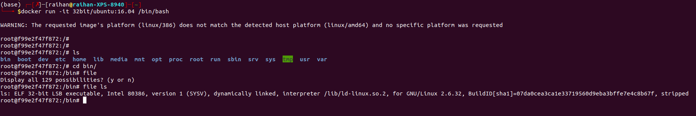

# Create 31 bit arm docker image with qemu
1. At first, you can search the docker images to find the `armv7hf`(I need armv7 32 bit image) docker images. Here is what I got,
```
(base) ┌─[raihan@raihan-XPS-8940]─[~/docker]
└──╼ $docker search armv7hf
NAME                               DESCRIPTION                                     STARS     OFFICIAL   AUTOMATED
balenalib/armv7hf-alpine           This image is part of the balena.io base ima…   5
balenalib/armv7hf-ubuntu           This image is part of the balena.io base ima…   5
balenalib/armv7hf-alpine-node      This image is part of the balena.io base ima…   4
balena/armv7hf-supervisor                                                          3
balenalib/armv7hf-debian           This image is part of the balena.io base ima…   2
balenalib/armv7hf-node             This image is part of the balena.io base ima…   1
balenalib/armv7hf-alpine-python    This image is part of the balena.io base ima…   1
balenalib/armv7hf-alpine-openjdk   This image is part of the balena.io base ima…   1
balenalib/armv7hf-ubuntu-python    This image is part of the balena.io base ima…   1
balenalib/armv7hf-python           This image is part of the balena.io base ima…   0
balenalib/armv7hf-golang           This image is part of the balena.io base ima…   0
balenalib/armv7hf-debian-python    This image is part of the balena.io base ima…   0
balenalib/armv7hf-ubuntu-node      This image is part of the balena.io base ima…   0
balenalib/armv7hf-debian-node      This image is part of the balena.io base ima…   0
balenalib/armv7hf-debian-golang    This image is part of the balena.io base ima…   0
balenalib/armv7hf-ubuntu-golang    This image is part of the balena.io base ima…   0
balenalib/armv7hf-fedora-python    This image is part of the balena.io base ima…   0
balenalib/armv7hf-fedora-openjdk   This image is part of the balena.io base ima…   0
balenalib/armv7hf-openjdk          This image is part of the balena.io base ima…   0
balenalib/armv7hf-ubuntu-openjdk   This image is part of the balena.io base ima…   0
balenalib/armv7hf-debian-openjdk   This image is part of the balena.io base ima…   0
balenalib/armv7hf-alpine-golang    This image is part of the balena.io base ima…   0
balenalib/armv7hf-fedora-golang    This image is part of the balena.io base ima…   0
balenalib/armv7hf-dotnet                                                           0
balenalib/armv7hf-debian-dotnet                                                    0
(base) ┌─[raihan@raihan-XPS-8940]─[~/docker]
└──╼ $
```
2. I used the `balenalib/armv7hf-debian`. So, go ahead and pull this arm 32 bit image
```
docker pull balenalib/armv7hf-debian
```
3. Now, as my system is of `x86-64` bit architechture, so, the platform `amd64` will not be compatible with this. So, I will need to run this on qemu

## Use QEMU
Install qemu
```
sudo apt-get install qemu qemu-user-static binfmt-support
sudo update-binfmts --enable qemu-arm # It should be enabled already
docker run --rm --privileged multiarch/qemu-user-static --reset -p yes
```
 - Now, run it on platform `linux/arm/v7`
```
docker run --platform linux/arm/v7 -it balenalib/armv7hf-debian /bin/bash
```
-- You got your shell --


**Generally if I run this `docker run balenalib/armv7hf-debian`. Then I will get the following error**
```
docker run balenalib/armv7hf-debian
WARNING: The requested image's platform (linux/arm/v7) does not match the detected host platform (linux/amd64) and no specific platform was requested
```

### Unsuccessful attempts
1. Tried to build the arm 32 bit image for buildroot in the `x86-64 bit` host machine with following Dockerfile [forced it but didn't work]
- Put this into a separate file, I named it `Dockerfile.buildroot_32bit`
```
# Dockerfile.buildroot_32bit
FROM busybox
ARG TARGETPLATFORM
ARG TARGETARCH
ARG TARGETVARIANT
RUN printf "I'm building for TARGETPLATFORM=linux/arm/v7, TARGETARCH=arm, TARGETVARIANT=v7"\
    && printf "With uname -s : Linux "\
    && printf "and  uname -m : armv7l"
```
2. Build this img
```
docker build -t arm-test -f Dockerfile.buildroot_32bit .
```

3. When I ran this `arm-test` 
```
docker run -it arm-test
```
Then found it was not 64 bit executable,
```
(base) ┌─[✗]─[raihan@raihan-XPS-8940]─[~/docker]
└──╼ $docker ps
CONTAINER ID   IMAGE      COMMAND   CREATED          STATUS          PORTS     NAMES
0d518334cc6c   arm-test   "sh"      57 seconds ago   Up 56 seconds             recursing_dewdney
(base) ┌─[raihan@raihan-XPS-8940]─[~/docker]
└──╼ $docker cp 0d518334cc6c:/bin/ls .
(base) ┌─[raihan@raihan-XPS-8940]─[~/docker]
└──╼ $ls
Dockerfile            Dockerfile.buildroot_32bit  pictures
Dockerfile.buildroot  ls                          README.md
(base) ┌─[raihan@raihan-XPS-8940]─[~/docker]
└──╼ $file ls
ls: ELF 64-bit LSB shared object, x86-64, version 1 (SYSV), dynamically linked, interpreter /lib64/ld-linux-x86-64.so.2, BuildID[sha1]=fea3053aecf7d40d8d2311409a0c9fd3dc7adbcd, for GNU/Linux 3.2.0, stripped
(base) ┌─[raihan@raihan-XPS-8940]─[~/docker]
└──╼ $

```


# 32bit/ubuntu image
Following is the link for 32 bit images for ubuntu,
[https://hub.docker.com/r/32bit/ubuntu/tags](https://hub.docker.com/r/32bit/ubuntu/tags)

### armhf image
Download this image,
```
docker pull 32bit/ubuntu:16.04-armhf
```
But this will not run in my intel machine. 

If I installed `qemu` as shown [above](https://github.com/mdrahmed/cheatsheets/blob/main/docker/README.md#use-qemu). If it is installed then the `qemu-user-static` will be present in the images of docker,


Now, run this to enable `qemu-user-static` image,
```
docker run --rm --privileged multiarch/qemu-user-static --reset -p yes
```

Now, run any of the following to get the `arm` shell,
```
# might need to specify the platform in some case and I can specify v7 if i want but it's not required
docker run --platform linux/arm/v7 -it 32bit/ubuntu:16.04-armhf /bin/bash
```
OR,
```
docker  run --platform linux/arm -it 32bit/ubuntu:16.04-armhf /bin/bash
```
OR,
```
docker run -it 32bit/ubuntu:16.04-armhf /bin/bash
```



### Intel image
I pulled the intel image,
```
docker pull 32bit/ubuntu:16.04
```
Then I have to run it by specifying the shell `/bin/bash`,
```
docker run -it 32bit/ubuntu:16.04 /bin/bash
```



# Create x86-64 arch 64 bit docker image
1. Create a file named Dockerfile.buildroot and add the following content:
```
FROM debian:bullseye

# Install necessary packages
RUN apt-get update && \
    apt-get install -y build-essential wget unzip rsync cpio

# Download and extract Buildroot
WORKDIR /buildroot
RUN wget https://buildroot.org/downloads/buildroot-2021.08.1.tar.gz && \
    tar -xzf buildroot-2021.08.1.tar.gz

WORKDIR /buildroot/buildroot-2021.08.1
```
2. Run the following command in the directory containing the Dockerfile.buildroot:
```
docker build -t buildroot_arm -f Dockerfile.buildroot .
```
3. Once the image is built, you can run a container based on this image and access the Buildroot environment:
```
docker run -it buildroot_arm /bin/bash
```
