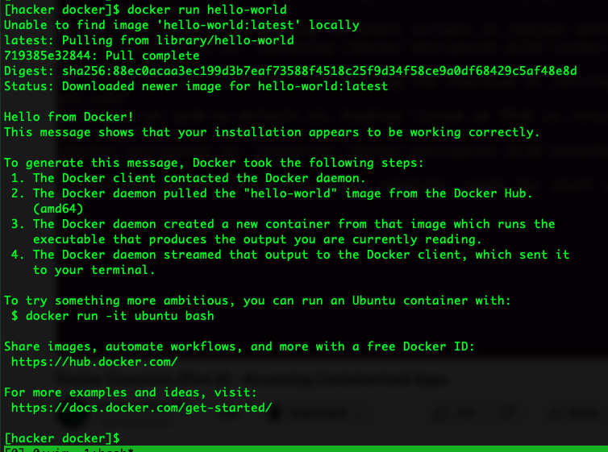
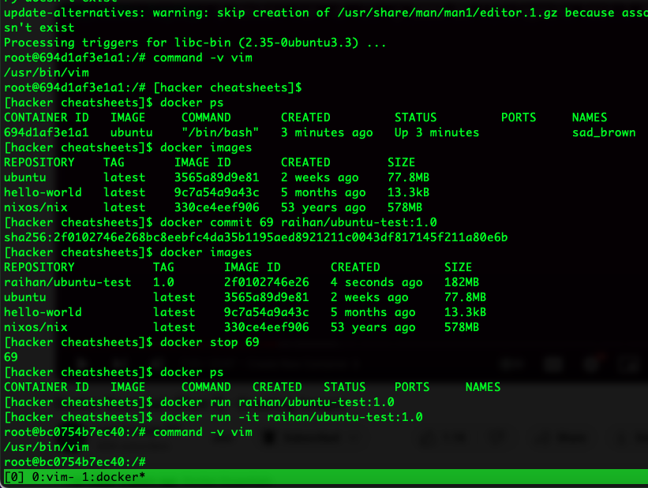
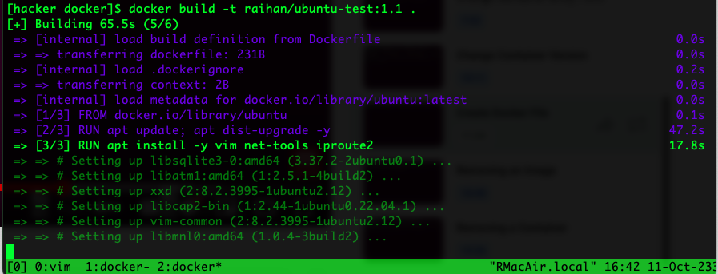
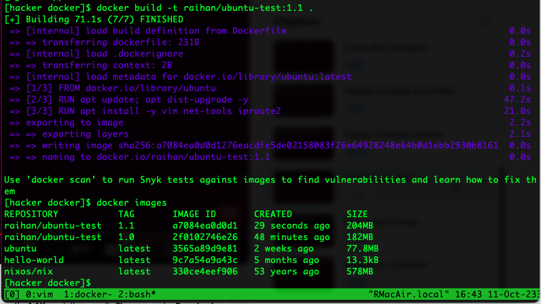
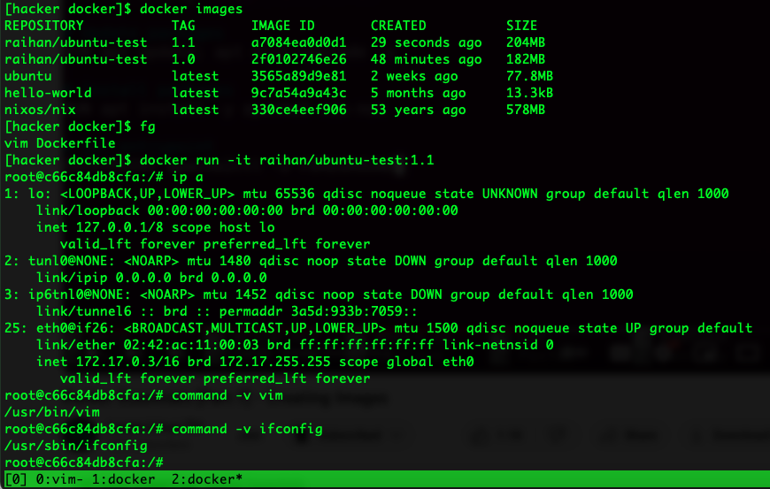
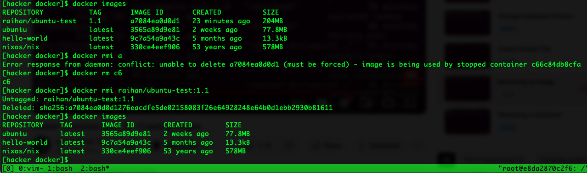
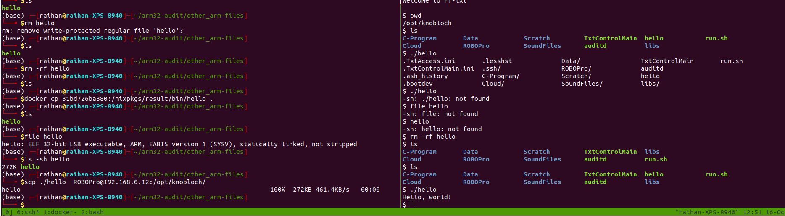

### Installing docker
**Mac**

[Download it from the docker site](https://www.docker.com/products/docker-desktop/) and then install it.
Keep it running to use docker on terminal

**ubuntu**
```
sudo apt update && sudo apt dist-upgrade
sudo apt install docker.io
```

Check if it's running,
```
systemctl status docker 
sudo systemctl enable docker # it might not be running
sudo systemctl start docker
```

Run a container,
```
sudo docker run hello-world
```


We have to use `sudo` to run docker everytime, so, add it to the user group,
```
sudo usermod -aG docker <username>
# logout and then login
# if still needs sudo then just reboot the system
```


### Running containers
```
docker images # to list containers
docker search ubuntu # to check the ubuntu containers
docker pull ubuntu # to download a container

docker run -it ubuntu # to run ubuntu 
# -i interactive -t tty(shell) interactive shell

ctrl+d # to exit the container and everything will be gone
ctrl + p + q # to exit without removing the files
# press ctrl then p and then q while holding ctrl

docker ps # to see the containers running
docker ps -a # it will also show the containers exited and running now

docker attach <container id> # just use the 1st 2/3 characters - 2 chars will work if there is no other container id's with the same the same chars
docker stop <container id 2 chars> # to stop the container
```

Keep containers running in the background
```
docker run -it -d ubuntu # it will run the container but exit right after
# -d activates daemon mode
docker ps # you can check if it's running
docker attach <container id> 
```

### Creating images
```
docker run -it ubuntu
# make changes e.g., install something/vim
ctrl + p + q # to keep the container running
docker ps # get the id
#docker commit <container id> <raihan/image_name(colon)version_no> # to create an image
docker commit 69 raihan/ubuntu-test:1.0
docker images # check the new image is present

# now stop the container because we have an image now
docker stop 69

# now run the image
docker run -it raihan/ubuntu-test:1.0 # the installed pkgs will still be present
```


### Pushing to hub
After committing the images e.g., after following step,
[Note: If I do not commit then the docker container will not persist meaning the changes will be lost]
```
#docker commit <container id> <raihan/image_name(colon)version_no> # to create an image
docker commit 69 raihan/ubuntu-test:1.0
docker images # check the new image is present

# now stop the container because we have an image now
docker stop 69
```
**PUSH**
Do this to push to docker hub,
```
docker tag local-image:tagname new-repo:tagname
docker login
docker push new-repo:tagname
```


**REMEMBER TO COMMIT AFTER EACH AND EVERY CHANGE BECAUSE THAT WILL BE LOST IF NOT COMMITTED. COMMIT WITH A DIFFERENT VERSION SO THAT IT'S EASIER TO TRACE.**

### Build images from Dockerfile
To automate the process of creating an image explained in step [Creating images](https://github.com/mdrahmed/cheatsheets/blob/main/docker/docker-init.md#creating-images), do the following.
1. Create a Dockerfile and paste following,
```
FROM ubuntu
MAINTAINER raihan <raihan@somewhere.net>

# update pkgs
RUN apt update; apt dist-upgrade -y

# install pkgs
RUN apt install -y vim net-tools iproute2
```
Now, run this,
```
docker build -t raihan/ubuntu-test:1.1 .
# -t is to set a tag
```



...



This will build the ubuntu-test of version 1.1. In the picture, you can see that the image has `vim, ifconfig, ip a` command. 
]

### Remove containers & images
```
docker rmi <container_id>
# If it is used by acontainer and getting a error response. Then remove the container first with the id shown in the error.
docker ps -a # It will show all other containers running
docker rm <container_id>

# Now, remove the image
docker rmi <container_id>
```


### nginx - not required
```
docker run -it -d -p 8080:80 nginx # -p port
docker ps # to get the container id
ip a # if ip not found then install iproute2 with sudo apt install iproute2 
# To get the ip address - check inet
# now goto the <ip>:8080
```

#### docker copy
```
docker cp <container_id_or_name>:/path/to/file/on/container /path/on/host
```
E.g.,
```
docker cp 31bd726ba380:/nixpkgs/result/bin/hello .
```

After copying the statically linked `hello` file it worked. 


