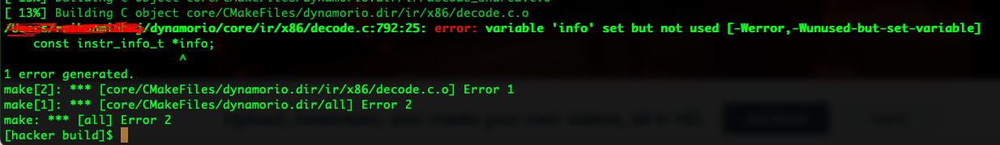

## Installing it OS X
See detailed installation information here: [building.dox](https://github.com/DynamoRIO/dynamorio/blob/64adf3b59bfb994a6e85e62f4ee05b3f86a1350f/api/docs/building.dox#L198)
```
git clone git@github.com:DynamoRIO/dynamorio.git
cd dynamorio
mkdir build
cd build
cmake -DDISABLE_WARNINGS=ON .. ## -Werror is enabled
make
sudo make install

# verify installation
drrun -version
# If it is not added, then add the path to bash_profile
export PATH="/path/to/your/dynamorio/bin64:$PATH"
source ~/.bash_profile
```


See [here for tutorials](https://github.com/DynamoRIO/dynamorio/blob/64adf3b59bfb994a6e85e62f4ee05b3f86a1350f/api/docs/tutorial.dox)

