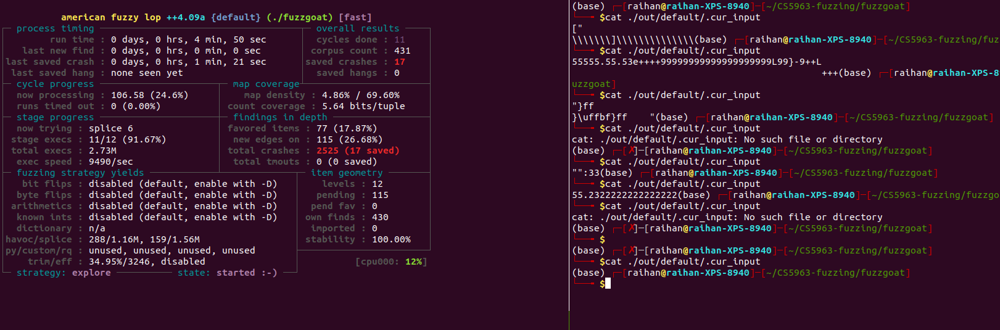

## Fuzzing book
Read this book: [https://www.fuzzingbook.org/](https://www.fuzzingbook.org/)

## Check default path
```
llvm-config --prefix
/usr/lib/llvm-6.0
```
If `llvm-config` not found then search for it by this `find / -name "llvm-config"
It should be present in this directory,
```
$which llvm-config
/usr/bin/llvm-config
```

## Change llvm default path
```
$ sudo update-alternatives --install         /usr/bin/llvm-config       llvm-config      /usr/bin/llvm-config-14  200
update-alternatives: using /usr/bin/llvm-config-14 to provide /usr/bin/llvm-config (llvm-config) in auto mode
```

## Fuzzing steps - yun
1. Use `afl-fuzz` to fuzz and find crashes
2. Then check if those crashes are false positives using the `address sanitizer`.
    [sanitizers](https://github.com/google/sanitizers/wiki/AddressSanitizer)
3. Then check if those crashes are already found.
    check [bugcrowd](https://www.bugcrowd.com/) or, [bugzilla](https://www.bugcrowd.com/)
4. If those are not predefined then these are the bugs not predefined.


## Check input provided by the fuzzer
```
# cat ./<out_dir>/default/.cur_input
cat ./out/default/.cur_input
```




