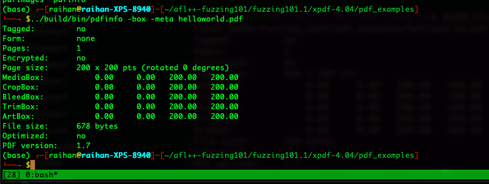

## Fuzzing latest xpdf
Install `xpdf-4.04`
```
https://dl.xpdfreader.com/xpdf-4.04.tar.gz
tar -xvzf <xpdf..>
mkdir build
cd build
cmake -DCMAKE_BUILD_TYPE=Release -DCMAKE_INSTALL_PREFIX=. ..
make make install
```

Download the pdfs, use the `xpdf` directory in place of `fuzzing_xpdf`,
```
cd $HOME/fuzzing_xpdf
mkdir pdf_examples && cd pdf_examples
wget https://github.com/mozilla/pdf.js-sample-files/raw/master/helloworld.pdf
wget http://www.africau.edu/images/default/sample.pdf
wget https://www.melbpc.org.au/wp-content/uploads/2017/10/small-example-pdf-file.pdf
```
Now, run this command inside this directory `../build/bin/pdfinfo -box -meta helloword.pdf` to get a output like following,


#### Instrument it with `afl-clang-fast++`

```
mv build build-old
mkdir build
cd build
cmake -DCMAKE_BUILD_TYPE=Release -DCMAKE_C_COMPILER=afl-clang-fast -DCMAKE_CXX_COMPILER=afl-clang-fast++ -DCMAKE_INSTALL_PREFIX=. ..
make
make install
```

Now, run the fuzzer with the following command,
```
afl-fuzz -i ./pdf_examples -o out -s 123 -- ./build/bin/pdftotext @@ output
```
Options:
 - -s indicates the static random seed to use.
 - @@ is the placeholder target's command line that AFL will substitute with each input file name.


I surprisingly found crashes in the latest `xpdf-4.04`,

