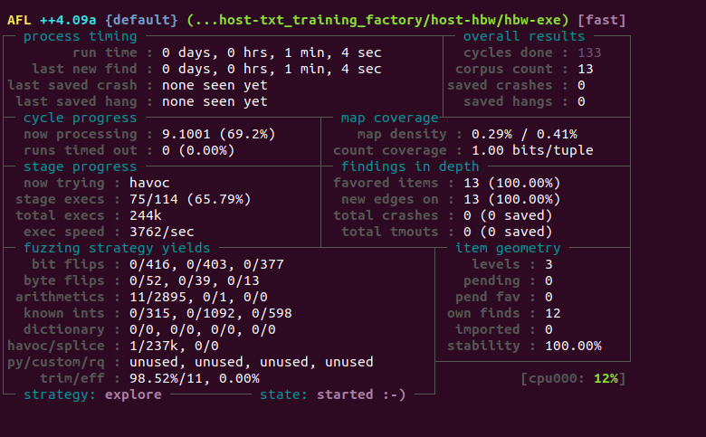

# Do following
Follow this: [Installing in Linux](https://github.com/AFLplusplus/AFLplusplus/blob/stable/docs/INSTALL.md#linux-on-x86)
```
sudo apt-get update
sudo apt-get install -y build-essential python3-dev automake cmake git flex bison libglib2.0-dev libpixman-1-dev python3-setuptools cargo libgtk-3-dev
# try to install llvm 14 and install the distro default if that fails
sudo apt-get install -y lld-14 llvm-14 llvm-14-dev clang-14 || sudo apt-get install -y lld llvm llvm-dev clang
sudo apt-get install -y gcc-$(gcc --version|head -n1|sed 's/\..*//'|sed 's/.* //')-plugin-dev libstdc++-$(gcc --version|head -n1|sed 's/\..*//'|sed 's/.* //')-dev
sudo apt-get install -y ninja-build # for QEMU mode
git clone https://github.com/AFLplusplus/AFLplusplus
cd AFLplusplus
make distrib
sudo make install
```

Now, goto the target program and do this,
```
# afl-cc or afl-c++
afl-c++ program.c
```

Now, goto AFLplusplus folder and fuzz it,
```
./afl-fuzz -i seeds_dir -o output_dir -- program
```

Add `-D` to tell afl++ to mutate on its own.
```
./afl-fuzz -i seeds_dir -o output_dir -D -- program

# E.g.,
./afl-fuzz -i ~/afl++-test/armstrong-c/input/ -o out/ -D -- ~/afl++-test/armstrong-c/a.out
```

## Target program is not compiled in AFL using `afl-cc`
Then run it in qemu-mode, use `-Q`,
```
./afl-fuzz -i ~/host-txt_training_factory/host-hbw/input/ -o outputs/out-txt/ -D -Q -- ~/host-txt_training_factory/host-hbw/hbw-exe
```


