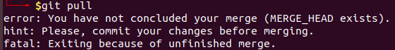

## Basic git commands
Quickstart git with these initial commands:
```
sudo apt install git

## initialize git
git init myrepo 
# or, init inside repo
git init

## Add the files
git add <filename>

## set user info with git config
git config --global user.name "raihan"
git config --global user.email "raihan@example.com"

## commit the file
git commit -m "<put some info about changes>"

## check the changes
git diff <filename>

## change branch name
git branch -M main
git remote add origin <url>

## push to github/gitlab
git push
# or, if branch changed
git push -u origin <branch name>

## Reverting to previous commit 
git log --oneline
# get the hash of the one you want to revert - most recent hash
git revert <hash>
# Add some info like ticket if there is a ticketing system

## clone a repo
git clone <ssh/https link>

## check the url
cat .git/config
# or, do following
git remote -v
```

### Ignore any file
To ignore a file, create a file `.gitignore`, and add filenames to the file.


## Advanced Git
##### Add part of a file to the commit
```
# p will bring you to the patch level
git add -p <filename>
# Type 'y' to add a part to the stage

# also check the changes if necessary with following,
git diff <filename>
```

##### Perfect commit message - its important while working with a team
Subject should be concise and add an empty line to tell git that you are writing the body of the msg.

##### Contributing to the open-source projects
1. First `fork` the repo
2. Now, create a branch
```
git branch test
git checkout test
```
3. Now, add and push to the branch
```
git status
git add <files>
git commit -m "changes"
git push --set-upstream origin test
```
4. Click the "Compare and pull request" and then click the "Create pull request"
In the forked repo, git will ask you if you want to create a pull request or not - "Compare and pull request"
5. Now, the maintainer of the repo will then be notified and they can review and if possible integrate the changes.

### Merge Conflict
#### Set `mergetool`
Just do following to set `vimdiff` as mergetool,
```
git config --global merge.tool vimdiff
```

Now, run following and solve the issue,
```
git mergetool
```

**After solving the issue, it might create multiple similar files. So, remove those files properly.** If it requires to pull and tells you to commit your changes like following, then just commit using 'git commit' and then pull.


##### Merge Conflicts
**`git merge --abort` and `git rebase --abort` will take you back to the previous state and all of the changes will be gone.**
`merge` is combining the changes and `rebase` is moving the changes from one branch to another branch.

If you don't have any `mergetool` then it should use `vimdiff` or `nvimdiff` depending on what you have. So, I will do it on `nvimdiff`,
```
git mergetool
# The topleft and topright are the modified files from both commits. The middle one at the top part is the base version before any commits.
# The bottom one is what git chooses as a final version, modify the bottom file to solve the conflicts.

### Remove the appearance of all following lines,
# <<<<< HEAD, ======, >>>>>>
# add or remove anyother lines, you need to remove

git pull
git commit -am "fixing merge conflicts"
git push
```

- From my point of view, I think the best merge tool is [kaleidoscope](https://kaleidoscope.app/). Buy it if you like it. If you have a tool then do following to merge the changes,
```
git mergetool
# Now, just solve the conflicts
```
- If you want to use something for free as `mergetool`, then checkout [diffmerge](https://sourcegear.com/diffmerge/downloads.html)
    - [Installation guide](https://sourcegear.com/diffmerge/webhelp/sec__inst__ubuntu.html). For mac, just download it from the above link.
    - [Set it up as mergetool](https://sourcegear.com/diffmerge/webhelp/sec__git__linux.html)
    - [Another usage guide](https://medium.com/@vitorhsb/how-to-set-diffmerge-as-git-merge-and-diff-tool-unix-40df346c11c4)

#### To see changes after Commiting 
Check all the changes made,
```
git show
```

Check just the files,
```
git show --name-only
```

See the names of the files without the diff,
```
git show --name-only -1
```

See the changes in a more condensed format,
```
git show --compact-summary
```

