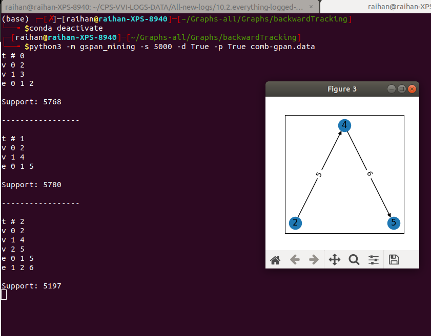

# gSpan-mining to find subgraphs from graph

## Installation
Using `gspan-mining` to make the graph smaller: https://pypi.org/project/gspan-mining/
Data: https://github.com/betterenvi/gSpan/blob/master/graphdata/graph.data

Installation: `pip install gspan-mining`
Run this code only to read data: `python -m gspan_mining -s 5000 ./graphdata/graph.data`

`gspan-mining` will find similar patterns in different graphs.

Run this code to see the graph: `python -m gspan_mining -s 5000 -p True ./graphdata/graph.data`
For directed subgraphs: 
     `python3 -m gspan_mining -s 5000 -d True -p True graph.data`
     Or, tell it to follow pattern.txt file,
     `python3 -m gspan_mining -s 5000 -d True -p pattern.txt graph.data`

which will need `matplotlib` and `networkx`,
```
pip3 install networkx
pip3 install matplotlib
```
If encountering errors while installing `matplotlib`, it will need following pkg's, simply install,
```
pip3 install pillow
sudo apt-get install libjpeg-dev
```

Using `networkx` to build such a big graph, install the following libraries,
```
pip3 install networkx
pip3 install scipy
```
I will also need `matplotlib`

The graph will be very messy. So, I will need to use `Gephi` to view the graph in png format.

**__Merge Graph:__**
```
import networkx as nx

# create an empty graph
merged_graph = nx.Graph()

# add nodes and edges from each of the 600 graphs
for graph in list_of_600_graphs:
    merged_graph = nx.compose(merged_graph, graph)

# now merged_graph contains all the nodes and edges from the 600 graphs
```

**__Merge graphviz graphs:__**
```
gvpack -u graph1.dot graph2.dot graph3.dot > merged_graph.dot
```
**Make sure you understand the purpose of using `-s`.**
running this for hbw.data,
```
python3 -m gspan_mining -s 10 -d True -p True hbw.data
```

This cmd for vgr and hbw to run gspan with the code,
```
python3 -m gspan_mining -s 10 -d True -p True vgr.data
```


This error is gone when I used neato like following,
```
graphVizG = graphviz.Digraph('vgr-graph')
graphVizG.engine = 'neato'
```

I think I can also use the `sfdp`,
```
graphVizG = graphviz.Digraph('vgr-graph')
graphVizG.engine = 'sfdp'
```

In this command `python3 -m gspan_mining -s 5000 -p True test.data` ,
`-s 5000` means that the minimum support threshold is set to 5000.** It implies that only subgraph patterns that occur at least 5000 times in the input data** will be considered significant and included in the output.

With 400 similar patterns, I got a good graph,
```
python3 -m gspan_mining -s 400 -p True data/hbw.data
```

## Generate subgraphs
Goto this folder `~/Graphs-all/Graphs/backwardTracking` adn run following for the `comb-gpan.data` file - __For me, it should be in the bash shell - outside conda__,
```
python3 -m gspan_mining -s 5000 -d True -p True comb-gpan.data
```

