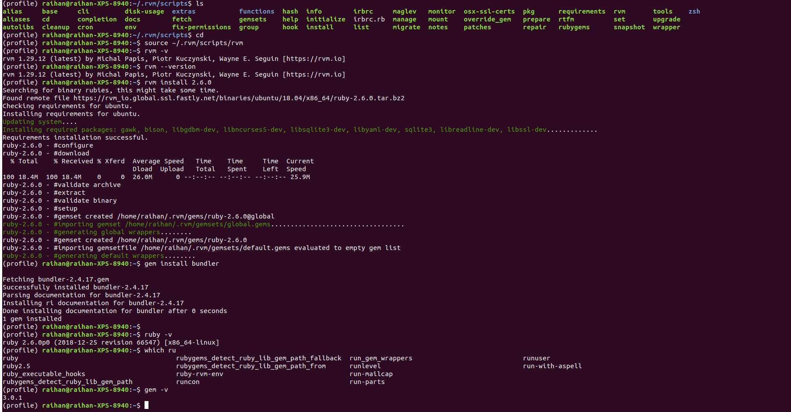
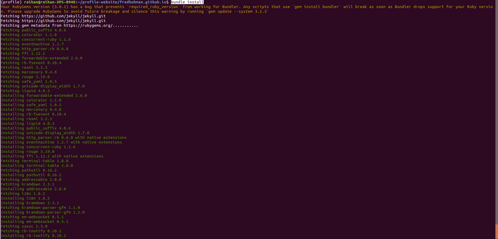

# Building websites with jekyll
Jekyll is a great tool to quickly create modern static websites. To include some more interactive pieces on our websites, we can use Node modules using npm packages manager and combine them using [webpack](https://webpack.js.org/) and [Babel](https://babeljs.io/) to “compile” the website.

Here I listed some problems I faced while using `npm` and `jekyll` to build my website.
1. If I install `bundle` with `gem` then it will not be compatible with ruby-2.5. It requires ruby version >=2.6.0
```
(profile) raihan@raihan-XPS-8940:~/profile-website/fredhohman.github.io$ sudo gem install bundler
Fetching: bundler-2.4.17.gem (100%)
ERROR:  Error installing bundler:
        The last version of bundler (>= 0) to support your Ruby & RubyGems was 2.3.26. Try installing it with `gem install bundler -v 2.3.26`
        bundler requires Ruby version >= 2.6.0. The current ruby version is 2.5.0.
(profile) raihan@raihan-XPS-8940:~/profile-website/fredhohman.github.io$ sudo gem install bundler -v 2.3.26
Fetching: bundler-2.3.26.gem (100%)
Successfully installed bundler-2.3.26
Parsing documentation for bundler-2.3.26
Installing ri documentation for bundler-2.3.26
Done installing documentation for bundler after 0 seconds
1 gem installed
(profile) raihan@raihan-XPS-8940:~/profile-website/fredhohman.github.io$ bundle install
Traceback (most recent call last):
        2: from /usr/local/bin/bundle:23:in `<main>'
        1: from /usr/lib/ruby/2.5.0/rubygems.rb:308:in `activate_bin_path'
/usr/lib/ruby/2.5.0/rubygems.rb:289:in `find_spec_for_exe': can't find gem bundler (>= 0.a) with executable bundle (Gem::GemNotFoundException)
```

To solve this, I tried to update `gem` first but didn't work,
```
(profile) raihan@raihan-XPS-8940:~$ sudo gem update --system 3.2.3
Updating rubygems-update
Successfully installed rubygems-update-3.2.3
Parsing documentation for rubygems-update-3.2.3
Done installing documentation for rubygems-update after 0 seconds
Parsing documentation for rubygems-update-3.2.3
Done installing documentation for rubygems-update after 0 seconds
Installing RubyGems 3.2.3
Traceback (most recent call last):
	4: from setup.rb:23:in `<main>'
	3: from setup.rb:23:in `require'
	2: from /var/lib/gems/2.5.0/gems/rubygems-update-3.2.3/lib/rubygems.rb:1348:in `<top (required)>'
	1: from /var/lib/gems/2.5.0/gems/rubygems-update-3.2.3/lib/rubygems.rb:1348:in `require'
/usr/lib/ruby/vendor_ruby/rubygems/defaults/operating_system.rb:43:in `<top (required)>': uninitialized constant Gem::BasicSpecification (NameError)
(profile) raihan@raihan-XPS-8940:~$ gem -v
2.7.6
(profile) raihan@raihan-XPS-8940:~$ ruby -v
ruby 2.5.1p57 (2018-03-29 revision 63029) [x86_64-linux-gnu]
```

## Just do the following from `gpg` cmd to install ruby 2.6.0
**SOLVED:** So, do following to solve this issue,
```
# set the key
gpg --keyserver hkp://keyserver.ubuntu.com --recv-keys 409B6B1796C275462A1703113804BB82D39DC0E3 7D2BAF1CF37B13E2069D6956105BD0E739499BDB 
curl -sSL https://rvm.io/mpapis.asc | gpg --import -

# curl the rvm
\curl -sSL https://get.rvm.io | bash -s stable

# run the terminal again with source initializing rvm
source ~/.rvm/scripts/rvm

# Install 3.1.0, bcz sass-embedded requires Ruby version >= 3.0.0. 
rvm install 3.1.0

#hacker:~$ gem install jekyll 
#ERROR:  Error installing jekyll:
#	The last version of sass-embedded (~> 1.54) to support your Ruby & RubyGems was 1.63.6. Try installing it with `gem install sass-embedded -v 1.63.6` and then #running the current command again
#	sass-embedded requires Ruby version >= 3.0.0. The current ruby version is 2.7.0.0.

# install bundle
gem install bundler

# now check
ruby -v
gem -v
```

Now, navigate to the working directory and run,
```
bundle install
npm run start # If not installed, install it sudo apt install npm
# It will show the addess of localhost it is running the website, probably this is the address: http://127.0.0.1:4000/
```


### To install jekyll
`gem install jekyll`

But as I installed `ruby-2.6.0` at the beginning, so, I have to install the `ruby-3.1.0` for `jekyll`
```
rvm install 3.1.0
```

But `ruby-2.6.0` was global and added to path, so, I did following,
```
export PATH="$PATH:$HOME/.rvm/gems/ruby-3.1.0/bin"
source ~/.bashrc
```
If still it doesn't work, then do this,
```
source $HOME/.rvm/scripts/rvm
rvm use 3.1.0
rvm use 3.1.0
rvm get stable --auto-dotfiles
ruby -v
gem install jeykyll
jekyll -v
```


### Now, use jekyll to make websites
 - Create a new Jekyll site at ./myblog.
```
jekyll new myblog
```
 - Change into your new directory.
```
cd myblog
```
 - Build the site and make it available on a local server.
```
bundle exec jekyll serve
```
Browse to [http://localhost:4000](http://localhost:4000)


## To use `npm` I need my bundle listen to > 3.2.1
Do this,
```
bundle update
```
If getting this error,
```
$ bundle install
Fetching gem metadata from https://rubygems.org/...........
Your bundle is locked to listen (3.2.1) from rubygems repository
https://rubygems.org/ or installed locally, but that version can no longer be
found in that source. That means the author of listen (3.2.1) has removed it.
You'll need to update your bundle to a version other than listen (3.2.1) that
hasn't been removed in order to install.
```
Soln: [https://stackoverflow.com/a/56431490/9263661](https://stackoverflow.com/a/56431490/9263661)


## sometimes the general push will not work, so for that push it with bin/deploy
Copy the bin dir inside the project directory, then do following,
```
bin/deploy --user
```

