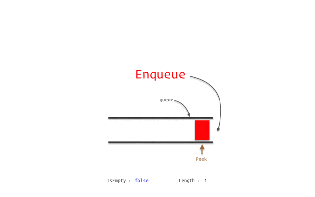

# Using leet effectively
* [Solve Leet 100 like questions](https://leetcode.com/problem-list/top-100-liked-questions/?sorting=W3sic29ydE9yZGVyIjoiREVTQ0VORElORyIsIm9yZGVyQnkiOiJBQ19SQVRFIn1d)
* [Solve Blind 75]
* If there is a interview to attend then just [find company wise questions and solve those](https://github.com/mdrahmed/cheatsheets/blob/main/leet_notes/README.md#find-the-company-wise-interview-questions).
* Otherwise, find problems from google list(given from 1st google interview) and solve those

# Find the Company wise interview questions
* [All interview question Leetcode](https://leetcode.com/discuss/interview-question?currentPage=1&orderBy=hot&query=)
* [Here is all google OA questions](https://leetcode.com/discuss/interview-question?currentPage=1&orderBy=most_relevant&query=google)

# One-line DS
1. `queue` is First-come-first-serve => Bus line


2. `stack` is Last-come-first-serve => pancakes


# Leet 100 like questions solutions

### [763. Partition Labels](https://leetcode.com/problems/partition-labels/)
The code is finding the lengths of contiguous substrings in s that contain unique characters. It uses the technique of maintaining a last dictionary to store the last occurrence index of each character encountered. By iterating over s and updating the end index to the maximum last occurrence index, it identifies the end of each unique substring. When the current index matches the end index, it calculates the length of the substring and appends it to the ans list. Finally, it returns the list of substring lengths.
**hashmap: Keep track of last char**
```
	ans = []
        last = {c: i for i, c in enumerate(s)}
        end = st = 0
        for i,c in enumerate(s):
            end = max(end, last[c])
            if i == end:
                ans.append(i-st+1)
                st = i+1
        return ans
```

### [46. Permutations](https://leetcode.com/problems/permutations/description/)
The code uses the backtracking technique to generate all possible permutations of the given nums array. It starts with an empty path and gradually adds elements to it, ensuring that each element is unique within the current path. When the path length reaches the length of nums, it adds a copy of the path to the result list. By recursively exploring all possible choices at each step, it generates all permutations. Looping is used to iterate over the elements of nums and check if an element is already present in the path before adding it.
**backtrack: base, append, pop**
```
        def backtrack(nums, path, result):
            if(len(path) == len(nums)):
                result.append(path.copy())
                return result
            
            for num in nums:
                if num not in path:
                    # path.append(num)
                    # backtrack(nums, path, result)
                    # path.pop()
                    new_path = path + [num]
                    backtrack(nums, new_path, result)
            
        result = []
        backtrack(nums, [], result)
        return result
```
Alternative:
```
        ans = []
        def get_permute(list):
            # print(list)
            if len(list) == len(nums):
                ans.append(list.copy())
                return
            else:
                for x in nums:
                    if x not in list:
                        list.append(x)
                        get_permute(list)
                        list.pop()
        
        get_permute([])
        return ans
```

### [78. Subsets](https://leetcode.com/problems/subsets/)
The code generates all possible subsets of the given nums array using the iterative approach. It initializes subsets with an empty subset and then iteratively generates new subsets by adding the current number to each existing subset. By utilizing list comprehension, it creates new subsets by appending the current number to each existing subset, and then extends the subsets list with these new subsets.
**loop + 2 di-array**
```
        def find_subsets(nums):
            subsets = [[]]

            for num in nums:
                subsets += [subset + [num] for subset in subsets]
                # new_subsets = []
                # for subset in subsets:
                #     new_subsets.append(subset + [num])
                # subsets.extend(new_subsets)
            return subsets

        result = find_subsets(nums)
        return result
```

### [226. Invert Binary Tree](https://leetcode.com/problems/invert-binary-tree/)
__left, right = right, left__
```
        if root is None:
            return None
        
        root.left, root.right = root.right, root.left

        self.invertTree(root.left)
        self.invertTree(root.right)

        return root
```

### [104. Maximum Depth of Binary Tree](https://leetcode.com/problems/maximum-depth-of-binary-tree/)
**left then right, max+1**
```
        if root is None:
            return 0

        leftDepth = self.maxDepth(root.left)
        rightDepth = self.maxDepth(root.right)

        return max(leftDepth, rightDepth) + 1
```

Alternative:
```
        if not root:
            return 0
        return 1+max(self.maxDepth(root.left),self.maxDepth(root.right))
```

### [94. Binary Tree Inorder Traversal](https://leetcode.com/problems/binary-tree-inorder-traversal/description/)
__left,root,right__
```
        ans = []

        if root is None:
            return []

        ans.extend(self.inorderTraversal(root.left))
        ans.append(root.val)
        ans.extend(self.inorderTraversal(root.right))

        return ans
```

### [22. Generate Parentheses](https://leetcode.com/problems/generate-parentheses/)
**backtrack, open then close; it's not append and pop**
```
        def backtrack(ans, curr, open_count, close_count):
            if len(curr) == 2 * n:  # Base case: the current combination is complete
                ans.append(curr)
                return

            if open_count < n:  # If the number of open parentheses is less than n, we can add an opening parenthesis
                backtrack(ans, curr + "(", open_count + 1, close_count)

            if close_count < open_count:  # If the number of closing parentheses is less than the number of open parentheses, we can add a closing parenthesis
                backtrack(ans, curr + ")", open_count, close_count + 1)

        result = []
        backtrack(result, "", 0, 0)  # Start the backtracking process
        return result
```

### [48. Rotate Image](https://leetcode.com/problems/rotate-image/)
__i,j to j,i and then rotate [i][::-1]__
```
        n = len(matrix)

        for i in range(n):
            for j in range(i,n):
                matrix[i][j],matrix[j][i] = matrix[j][i],matrix[i][j]
        
        for i in range(n):
            matrix[i] = matrix[i][::-1]
```

### [118. Pascal's Triangle](https://leetcode.com/problems/pascals-triangle/description/)
__[i-1][j-1] + [i-1][j]__
```
        triangle = []
        for i in range(numRows):
            row = []
            for j in range(i + 1):
                if j == 0 or j == i:
                    row.append(1)
                else:
                    row.append(triangle[i - 1][j - 1] + triangle[i - 1][j])
            triangle.append(row)
            
        return triangle
```
#### Similar question to `118. Pascal's Triangle`
-[119. Pascal's Triangle II](https://leetcode.com/problems/pascals-triangle-ii/description/)
**Done by me**
```
        triangle = []
        for i in range(rowIndex+1):
            row = []
            for j in range(i+1):
                if j==0 or j==i:
                    row.append(1)
                else:
                    row.append(triangle[i-1][j-1] + triangle[i-1][j])
            triangle.append(row)
        return row
```
*1 More*


### [136. Single Number](https://leetcode.com/problems/single-number/description/)
**XOR returns 1 if corresponding 2 bits are different. XOR a number with itself it will return 0, so, XORing same number cancels each other.**
```
        result = 0
        for num in nums:
            result ^= num
        return result
```
#### Similar questions to `136. Single Number`

-[137. Single Number II](https://leetcode.com/problems/single-number-ii/description/)
**Done by me**
```
        hp = {}
        for num in nums:
            if num in hp:
                hp[num] += 1
            else:
                hp[num] = 1
            
        for k in hp:
            if hp[k] == 1:
                ans = k
        
        return ans
```
-[260. Single Number III](https://leetcode.com/problems/single-number-iii/description/)
**Done by me**
```
        hp = {}
        for num in nums:
            if num in hp:
                hp[num] += 1
            else:
                hp[num] = 1
        ans = []
        for k in hp:
            if hp[k] == 1:
                ans.append(k)
        return ans
```
-[268. Missing Number](https://leetcode.com/problems/missing-number/description/)
**Done by me**
```
        n = len(nums)
        summ = (n * (n+1))//2
        missing_sum = 0
        for num in nums:
            missing_sum += num
        print(summ)
        print(missing_sum)
        return summ-missing_sum
```
-[287. Find the Duplicate Number](https://leetcode.com/problems/find-the-duplicate-number/description/)
**Done by me**
```
        hp = {}
        for num in nums:
            if num in hp:
                hp[num] += 1
            else:
                hp[num] = 1
            
        for key in hp:
            if hp[key] > 1:
                return key
```
_1 more_

### [230. Kth Smallest Element in a BST](https://leetcode.com/problems/kth-smallest-element-in-a-bst/description/)
**The elements are sorted in inorder traversal in BST.** Do inorder and count to k
```
        self.count = 0
        self.result = None

        def inorder(node):
            if node is None or self.count >= k:
                return
            
            inorder(node.left)
            self.count += 1
            if self.count == k:
                self.result = node.val
                return
            inorder(node.right)

        inorder(root)
        return self.result

[Note: In here, I am using `self.count` and `self.result` because I am trying to modify this within another function. And as it is a local variable and not a mutable object like list, dict, set, bytearrays. If it's a mutable object then I could use it e.g., if it was a list then I will only be accessing and appending the values into it, so, at that time it's possible to call it without making it nonlocal or `self`. I can't modify it without making it nonlocal. I can make it nonlocal using the keyword `nonlocal count, result` inside `inorder` function or just simply use the `self` to access and modify this]
```

### [39. Combination Sum](https://leetcode.com/problems/combination-sum/description/)
**backtrack => determine base case, append and pop**
```
	result = []
        def backtrack(start, path, current_sum):
            if current_sum == target:
                result.append(path[:])
                return
            if current_sum > target:
                return
            
            for i in range(start, len(candidates)):
                path.append(candidates[i])
                backtrack(i, path, current_sum + candidates[i])
                path.pop()
        
        backtrack(0, [], 0)
        return result
```
TC: `O(2^n * n)`

__Alternate Approach (DP):__
__dp is all about storing all the values in their array after specific calculation__
```
        dp = [[] for _ in range(target + 1)]
    
        # Base case: there is one way to make 0, which is an empty combination
        dp[0].append([])
        
        # Iterate through all candidates
        for candidate in candidates:
            # For each candidate, iterate from the candidate value up to the target
            for i in range(candidate, target + 1):
                # For each sum i, iterate through all combinations that can lead to this sum
                for combination in dp[i - candidate]:
                    # Append the current candidate to each combination to form new combinations
                    new_combination = combination + [candidate]
                    dp[i].append(new_combination)
        
        return dp[target]
```
TC: `O(target * n * m)`, where n is the number of candidates and m is the average length of the combinations. 

### [49. Group Anagrams](https://leetcode.com/problems/group-anagrams/description/)
__sort the word => ''.join(sorted(word)). Use defaultdict because that will initiate 0 if that value is not defined before__
```
        groups = defaultdict(list)

        for word in strs:
            sorted_word = ''.join(sorted(word))
            groups[sorted_word].append(word)
        
        return groups.values()
```
TC: O(n * m * log m)
1. Iterating through the strs list: O(n)
2. Sorting each word: O(m * log m)
3. Accessing and appending to the groups dictionary: O(1)

The time complexity of sorting a word is O(m * log m) because sorting a string of length m requires comparing and rearranging the characters, which has a complexity of O(m * log m) using efficient sorting algorithms like Timsort (used by Python's `sorted` function)

__Alternate approach (using regular python dict):__
```
        groups = {}

        for word in strs:
            sorted_word = ''.join(sorted(word))
            if sorted_word in groups.keys():
                groups[sorted_word].append(word)
            else:
                groups[sorted_word] = [word]
            
        return groups.values()
```
TC: O(n * m * log m)

#### Similar question to `49. Group Anagrams`
-[2273. Find Resultant Array After Removing Anagrams](https://leetcode.com/problems/find-resultant-array-after-removing-anagrams/)
```
        def isAnagram(word1, word2):
            return sorted(word1) == sorted(word2)
        result = []
        for word in words:
            if len(result) == 0 or not isAnagram(word, result[-1]):
                result.append(word)
        return result
```

### [215. Kth Largest Element in an Array](https://leetcode.com/problems/kth-largest-element-in-an-array/description/)
__Algorithm used: quickselect__
* Choose a pivot element from the array. This pivot element will be used to partition the array.
* Partition the array into two parts: elements greater than or equal to the pivot on one side, and elements less than the pivot on the other side.
* If the pivot index is equal to k-1, return the pivot element as the kth largest element.
* If the pivot index is less than k-1, continue the partitioning process on the right subarray.
* If the pivot index is greater than k-1, continue the partitioning process on the left subarray.
By selectively partitioning the array, you can find the kth largest element without sorting the entire array. This approach allows you to achieve a time complexity of O(n) on average.

```
import random
        def partition(left, right, pivot_idx):
            pivot = nums[pivot_idx]
            # Move pivot to the rightmost position
            nums[pivot_idx], nums[right] = nums[right], nums[pivot_idx]
            # Perform partitioning
            store_idx = left
            for i in range(left, right):
                if nums[i] < pivot:
                    nums[i], nums[store_idx] = nums[store_idx], nums[i]
                    store_idx += 1
            # Move pivot back to its sorted position
            nums[store_idx], nums[right] = nums[right], nums[store_idx]
            return store_idx

        def quickselect(left, right, k_smallest):
            if left == right:
                return nums[left]
            
            # Choose a random pivot index
            pivot_idx = random.randint(left, right)
            
            # Perform partitioning and get the updated pivot index
            pivot_idx = partition(left, right, pivot_idx)
            
            # If the pivot is the k-th largest element, return it
            if k_smallest == pivot_idx:
                return nums[k_smallest]
            # If the k-th largest element is in the left subarray, recursively call quickselect on the left subarray
            elif k_smallest < pivot_idx:
                return quickselect(left, pivot_idx - 1, k_smallest)
            # If the k-th largest element is in the right subarray, recursively call quickselect on the right subarray
            else:
                return quickselect(pivot_idx + 1, right, k_smallest)

        # Convert k to the k-th smallest index
        k_smallest = len(nums) - k
        
        # Call quickselect to find the k-th largest element
        return quickselect(0, len(nums) - 1, k_smallest)
```


### [739. Daily Temperatures](https://leetcode.com/problems/daily-temperatures/description/)
Given an array of integers temperatures represents the daily temperatures, return an array answer such that answer[i] is the number of days you have to wait after the ith day to get a warmer temperature.

**stack-based approach: This solution iterates through the temperatures array once, maintaining a stack of indices. For each temperature, it checks if it is greater than the temperature corresponding to the top index in the stack. If so, it updates the answer for that index and continues this process until a warmer temperature is found or the stack is empty.**

 1. `stack` er modde ek ekta index add korte thakbo, 
 2. jkn e ager ta theke boro pabo tkn e `stack` theke pop kora suru ar `ans` e bortoman `i` theke `prev_ind` bad dia add korte hobe  
 3. eita colte thakbe until stack khali na hoy or, `stack` er value bortoman value theke boro na hoy
```
        stack = []
        ans = [0] * len(temperatures)

        for i in range(len(temperatures)):
            while stack and temperatures[i] > temperatures[stack[-1]]:
                prev_index = stack.pop()
                ans[prev_index] = i - prev_index
            stack.append(i)

        return ans
```
TO: O(n)

### [131. Palindrome Partitioning](https://leetcode.com/problems/palindrome-partitioning/description/?envType=featured-list&envId=top-100-liked-questions)
**Use backtracking**
```
        result = []
        current = []

        def is_palindrome(string):
            return string == string[::-1]

        def backtrack(start):
            if start >= len(s):
                result.append(list(current))
                return
            
            for end in range(start, len(s)):
                substring = s[start:end+1]
                if is_palindrome(substring):
                    current.append(substring)
                    backtrack(end + 1)
                    current.pop()

        backtrack(0)
        return result
```

### [51. N-Queens](https://leetcode.com/problems/n-queens/?envType=featured-list&envId=top-100-liked-questions)
**Backtrack:** This code uses a recursive backtracking algorithm to explore all possible placements of queens on the chessboard. The backtrack function is called recursively for each row, and it checks if a queen can be placed in a particular column. It also maintains sets of occupied columns, diagonals, and anti-diagonals to ensure that no two queens attack each other.
**If in recursion, I am using list, then I have to `append` and then `pop` but if I use `set()` then I need to `add` and then `remove`.**
```
        def backtrack(row, cols, diagonals, anti_diagonals, board, result):
            if row == n:
                result.append([''.join(row) for row in board])
                return
            
            for col in range(n):
                diagonal = row - col
                anti_diagonal = row + col
                
                if col in cols or diagonal in diagonals or anti_diagonal in anti_diagonals:
                    continue
                
                board[row][col] = 'Q'
                cols.add(col)
                diagonals.add(diagonal)
                anti_diagonals.add(anti_diagonal)
                
                backtrack(row + 1, cols, diagonals, anti_diagonals, board, result)
                
                board[row][col] = '.'
                cols.remove(col)
                diagonals.remove(diagonal)
                anti_diagonals.remove(anti_diagonal)
        
        result = []
        board = [['.' for _ in range(n)] for _ in range(n)]
        cols = set()
        diagonals = set()
        anti_diagonals = set()
        
        backtrack(0, cols, diagonals, anti_diagonals, board, result)
        
        return result
```
TO: `O(N!)`, where N represents the size of the chessboard.
Since each row has N choices (columns) to place a queen, and for each row, we need to check if the position is under attack, the number of recursive calls made by the backtracking algorithm is on the order of N * N-1 * N-2 * ... * 1, which is N!.

**Done by me**
```
        board = [['.' for _ in range(n)] for _ in range(n)]
        rows = []
        cols = []
        d1s = []
        d2s = []    
        result = []

        def b(row, rows, cols, d1s, d2s, board):
            # global rows
            if row == n:
                print(board)
                result.append([''.join(row) for row in board])
                return
            for col in range(n):
                d1 = row+col
                d2 = row-col
                if row not in rows and col not in cols and d1 not in d1s and d2 not in d2s:
                    d1s.append(d1)
                    d2s.append(d2)
                    rows.append(row)
                    cols.append(col)
                    board[row][col] = 'Q'
                    b(row+1, rows, cols, d1s, d2s, board)
                    
                    board[row][col]='.'
                    rows.pop()
                    d1s.pop()
                    d2s.pop()
                    cols.pop()

        b(0, rows, cols, d1s, d2s, board)        
        return result
```

### [102. Binary Tree Level Order Traversal](https://leetcode.com/problems/binary-tree-level-order-traversal/description/?envType=featured-list&envId=top-100-liked-questions)
**BFS can be used to find level-order**. To perform a level order traversal of a binary tree, you can use the Breadth-First Search (BFS) algorithm with the help of a queue. Here's an algorithm to achieve the level order traversal:
1. Create an empty queue and enqueue the root node.
2. Create an empty list to store the level order traversal result.
3. While the queue is not empty:
4.  Dequeue a node from the front of the queue.
5.  Add the value of the dequeued node to the level order traversal result list.
6.  Enqueue the left and right children of the dequeued node, if they exist.
7. Return the level order traversal result list.

```
from collections import deque
        if not root:
            return []
        
        result = []
        queue = deque()
        queue.append(root)
        
        while queue:
            level_size = len(queue)
            current_level = []
            
            for _ in range(level_size):
                node = queue.popleft()
                current_level.append(node.val)
                
                if node.left:
                    queue.append(node.left)
                if node.right:
                    queue.append(node.right)
            
            result.append(current_level)
        
        return result
```
TO: `O(n)`, where n is the number of nodes in the binary tree.

### [347. Top K Frequent Elements](https://leetcode.com/problems/top-k-frequent-elements/)
**Hashmap solution:**Just remember how to sort the hashmap
`hp_sorted = dict(sorted(hp.items(), key=lambda x: x[1], reverse=True))`

```
        hp = {}
        ans = []
        for num in nums:
            if num in hp:
                hp[num] += 1
            else:
                hp[num] = 1
        hp_sorted = dict(sorted(hp.items(), key=lambda x: x[1], reverse=True))
        loop = 1
        for key in hp_sorted:
            ans.append(key)
            if loop == k:
                break
            loop+=1
        
        return ans
```
TO: `O(n log n)`, Python `sorted()` function uses `Tim sort` which has a complexity of `O(n log n)`

**Heap and hashmap combine solution:** Using `counter` class`
For a min-heap, the heap property states that for any node i, the value of the parent node is less than or equal to the values of its child nodes. In a max-heap, the property is the opposite, where the value of the parent node is greater than or equal to the values of its child nodes.
By using `heapq.heapify(heap)`, the elements in the list are rearranged so that the heap property is satisfied. **By default, Python's heapq module creates a min-heap, so we invert the sign of the frequency to achieve the effect of a max-heap.**

```
import heapq
from collections import Counter
    # Count the frequency of each element in nums
    counter = Counter(nums)
    
    # By default, Python's heapq module creates a min-heap, so we invert the sign of the frequency to achieve the effect of a max-heap.
    # Create a heap of (-frequency, element) pairs, I have used negation, so that if I sort those using `heapq` then the element with top freq will be in 1st position
    heap = [(-freq, num) for num, freq in counter.items()]
    
    # Convert the heap into a priority queue
    heapq.heapify(heap)
    
    # Get the top k elements from the priority queue
    top_k = [heapq.heappop(heap)[1] for _ in range(k)]
    
    return top_k
```
TO:`O(n log k)`, where n is the length of the input array nums and k is the desired number of most frequent elements. 
    Counting the frequency of each element using Counter(nums): This step takes O(n) time complexity as it iterates through the input array nums once to count the frequency of each element.
    Creating the heap: Creating the heap of (-frequency, element) pairs takes O(n) time complexity since it iterates through the counter items, which has a maximum length of n.
    Converting the heap into a priority queue using heapify(heap): This operation takes O(k) time complexity as it only needs to heapify the first k elements of the heap.
    Extracting the top k elements from the priority queue: Extracting the top k elements using heappop() takes O(k log k) time complexity. Since the heap contains at most k elements, extracting each element takes O(log k) time complexity, and we perform this operation k times.

### [169. Majority Element](https://leetcode.com/problems/majority-element/description/?envType=featured-list&envId=top-100-liked-questions)
**Hashmap solution:** Just sort the array and get the 1st element
```
        hp = {}
        for num in nums:
            if num in hp:
                hp[num] += 1
            else:
                hp[num] = 1
        hp_sorted = dict(sorted(hp.items(), key=lambda x: x[1], reverse=True))
        first_key = next(iter(hp_sorted))

        return first_key
```
TO: `O(n log n)`, Sorting a dictionary of hashmap takes `O(n log n)` time complexity.

**Boyer-Moore Voting Algorithm:** The algorithm finds the majority element in a single pass over the array and works under the assumption that the majority element will always exist.
```
        count = 0
        candidate = None

        for num in nums:
            if count == 0:
                candidate = num
            count += 1 if num == candidate else -1

        return candidate
```
TO: `O(n)`
