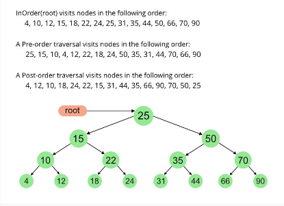

# Top 100 liked questions

## Permutation/Combinatorials:
[46. Permutations](https://leetcode.com/problems/permutations/description/)

Need to use backtrack to find the permutations, which is a recursive algorithm, this recursive algorithm must have a base case. 

## Subsets:
[78 subsets](https://leetcode.com/problems/subsets/)

To find subsets in an array,
```
		subsets = [[]]
		subsets += [subset + [num] for subset in subsets]
```
This is exactly like following,
```
		subsets = [[]]
		new_subset = []
		for subset in subsets:
			new_subset.append(subset + [num]) # It will add subset for the current num
		subsets.extend(new_subsets)  # It will add all those findings to the list of subsets 
```
***
If I add 2 list then it will concatenate,
	`[] + [1] = [1]`, it concatenates.
	`[1] + [2] = [1,2]
***


## Binary Tree: 
[226. Invert Binary Tree](https://leetcode.com/problems/invert-binary-tree/)

In the array representation, if a node is at index i, 
	its left child will be at index `2*i+1`, and 
	its right child will be at index `2*i+2`. 
	Conversely, for a given node at index i, its parent will be at index `(i-1)//2`.

---
Binary tree is a structure that is generally defined like following,
```
class TreeNode:
    def __init__(self, val=0, left=None, right=None):
        self.val = val
        self.left = left
        self.right = right
```
**Don't forget to use `self` if a function is defined in python.**

---

[104. Maximum Depth of Binary Tree](https://leetcode.com/problems/maximum-depth-of-binary-tree/)
Length of the longest path from the root node to any leaf node in the tree. 
To count the path, do following,
* If root is none, then return 0. 
* Traverse left and right subtree.
* Then add 1 to the max of left and right

[94. Binary Tree Inorder Traversal](https://leetcode.com/problems/binary-tree-inorder-traversal/description/)
Inorder traversal: left, root, right



```
ans.extend(root.left)
ans.append(root.val)
ans.extend(root.right)
```
`extend` adds elements of the subtree but `append` adds the whole subtree into the list. In this case, if the root is none then I will return an empty list. 

