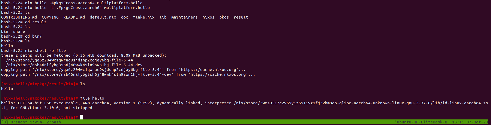

# Running on docker
```
docker search nixos
docker pull nixos/nix
docker run -it nixos/nix
```
Inside nix,
```
nix-env -i vim
git clone https://github.com/NixOS/nixpkgs.git
nix --version # check version if it the updated one e.g., more than 2.4
```
Use flake
```
vim nix /etc/nix/nix.conf # check if there is flake otherwise put the following at the end of nix.conf
experimental-features = nix-command flakes
```
Install `git` if not present `nix-shell -p git`.


## Now, We can start with Cross-compilation
After downloading the nix pkgs, I should do following inside `nixpkgs` folder. But following code and TAB is not working for some reason. But this can be done.
```
nix build .#pkgsCross. # hit TAB to see every possible nixpkgs
```

For testbed, I choose `armhf-embedded`
```
nix build .#pkgsCross.armhf-embedded. # If I hit tab now then it will show there is a lot of nix pkgs
nix build .#pkgsCross.armhf-embedded.hello # I choose hello
```
But with this I got following error, there is no `hello` pkg. So, I used `aarch64` just to check how it works,
```
bash-5.2# nix build .#pkgsCross.armhf-embedded.hello                                                                                                                                                       
error: builder for '/nix/store/fjkcpz3wbkxwzs1ldlqymhwmygycg4k1-hello-arm-none-eabihf-2.12.1.drv' failed with exit code 77;                                                                                
       last 10 log lines:                                                                                                                                                                                  
       > checking for arm-none-eabihf-strip... arm-none-eabihf-strip                                                                                                                                       
       > checking for a thread-safe mkdir -p... /nix/store/y9gr7abwxvzcpg5g73vhnx1fpssr5frr-coreutils-9.3/bin/mkdir -p                                                                                     
       > checking for gawk... gawk                                                                                                                                                                         
       > checking whether make sets $(MAKE)... yes                                                                                                                                                         
       > checking whether make supports nested variables... yes                                                                                                                                            
       > checking for arm-none-eabihf-gcc... arm-none-eabihf-gcc                                                                                                                                           
       > checking whether the C compiler works... no                                                                                                                                                       
       > configure: error: in `/tmp/nix-build-hello-arm-none-eabihf-2.12.1.drv-0/hello-2.12.1':                                                                                                            
       > configure: error: C compiler cannot create executables                                                                                                                                            
       > See `config.log' for more details                                                                                                                                                                 
       For full logs, run 'nix log /nix/store/fjkcpz3wbkxwzs1ldlqymhwmygycg4k1-hello-arm-none-eabihf-2.12.1.drv'.
```

## Different platform
Now, trying for `aarch64` linux,
```
nix build .#pkgsCross.aarch64-multiplatform.hello # It worked fine
```


Just use `-L` to see the logs,
```
nix build -L .#pkgsCross.aarch64-multiplatform.hello # run it inside nixpkgs folder
```

But this binary is dynamically linked,
```
[nix-shell:/nixpkgs/result/bin]# file hello 
hello: ELF 64-bit LSB executable, ARM aarch64, version 1 (SYSV), dynamically linked, interpreter /nix/store/3wms3517c2v59y1z5911vz1fj3vkm9cb-glibc-aarch64-unknown-linux-gnu-2.37-8/lib/ld-linux-aarch64.so.1, for GNU/Linux 3.10.0, not stripped
```



To statically link the binary, so that it is build with all the necessary library files. After building a static library it will not look for libraries in the host platform, so if I don't have the static library then also this statically link file will work.
Just do following, to make this static,
```
nix build -L .#pkgsCross.aarch64-multiplatform.pkgsStatic.hello # run it inside the nixpklgs folder
# I can rebuild it but rebuild didn't work for me
nix build -L .#pkgsCross.aarch64-multiplatform.pkgsStatic.hello --rebuild
```

...


Now, this file is statically linked,
```
bash-5.2# ls 
CONTRIBUTING.md  COPYING  README.md  default.nix  doc  flake.nix  lib  maintainers  nixos  pkgs  result
bash-5.2# cd result
bash-5.2# ls
bin  share
bash-5.2# cd bin/
bash-5.2# ls
hello
bash-5.2# nix-shell -p file

[nix-shell:/nixpkgs/result/bin]# file hello 
hello: ELF 64-bit LSB executable, ARM aarch64, version 1 (SYSV), statically linked, not stripped

[nix-shell:/nixpkgs/result/bin]# 
```

