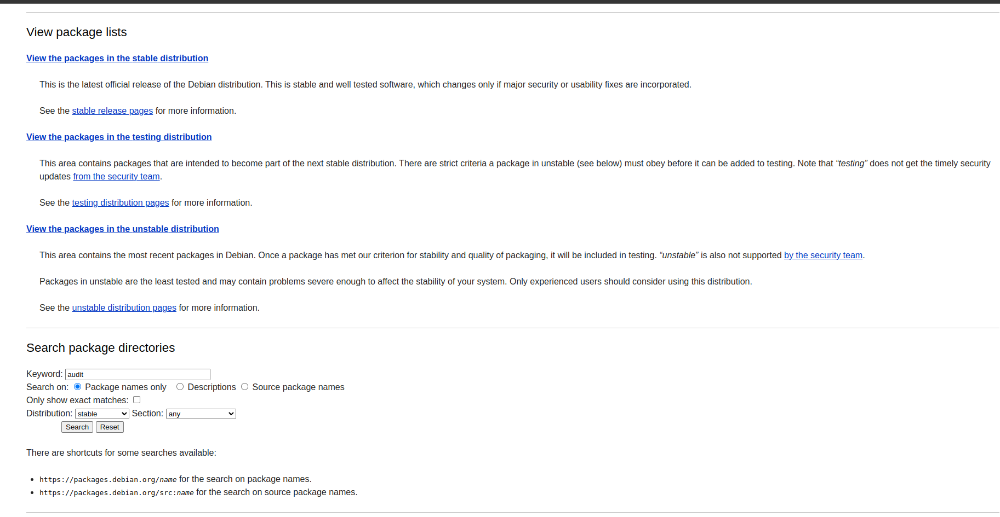
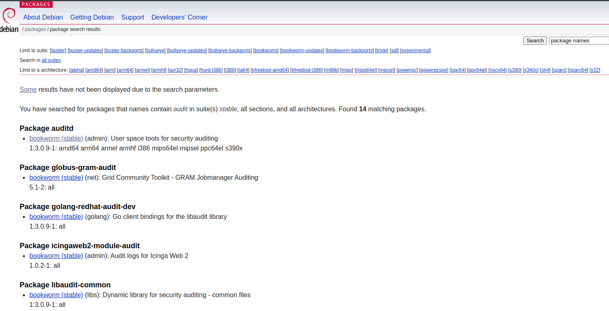
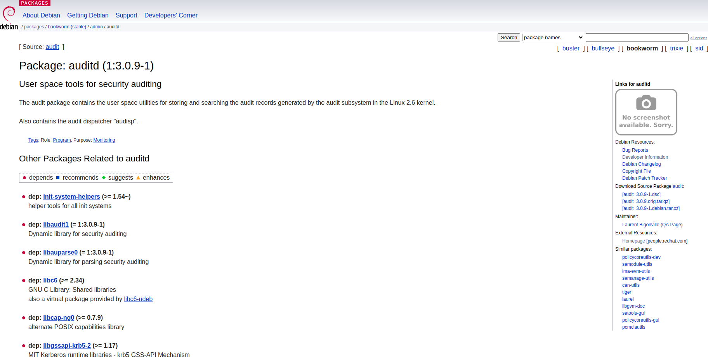
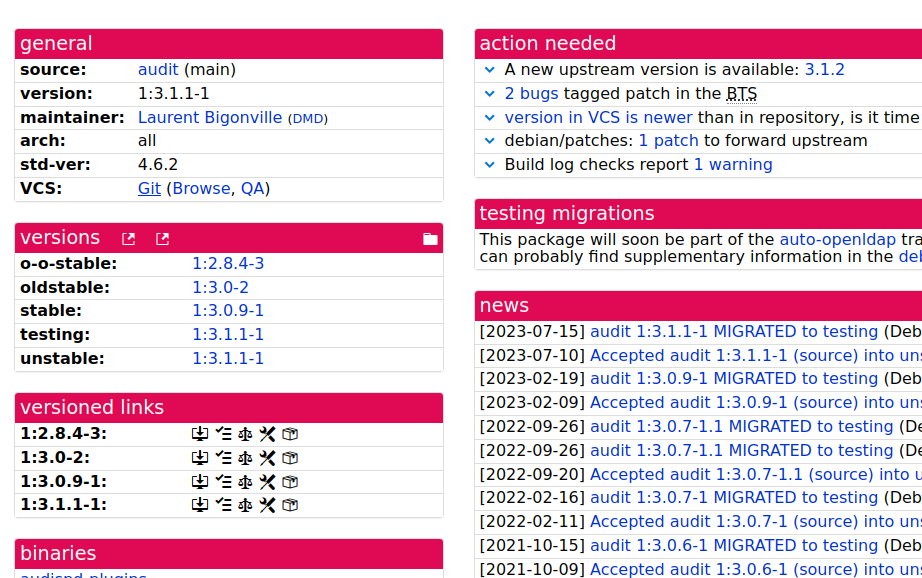

### Debian packages
1. Debian packages: https://packages.debian.org/nl/
 - Search audit and press enter
2. On that page find latest one: https://packages.debian.org/search?keywords=audit&searchon=names&suite=bookworm&section=all
 - The latest one in my case is package auditd `bookworm (stable)`, press enter
3. One that page click `Developer Information`: https://packages.debian.org/bookworm/auditd
4. Click git: https://tracker.debian.org/pkg/audit
5. You are on the auditd page: https://salsa.debian.org/debian/audit
6. Now, to compile this, do following,
```
./configure # if configure is not there then autoconfig
# It will create a Makefile
make # run make
```






**Do it on Nixos**
