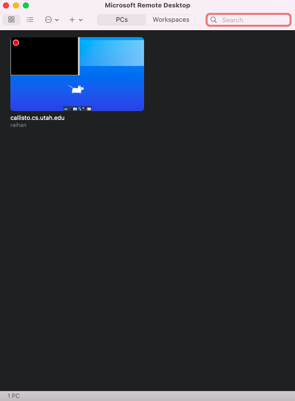
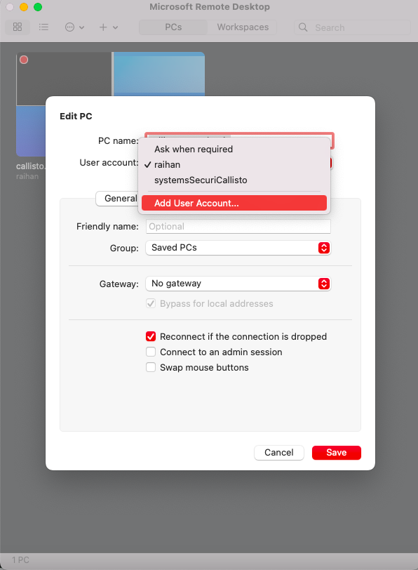

# Set up the GUI server with Microsoft Remote Desktop
To set up the remote desktop, follow the following guidelines,
1. Run the following script to install `xrdp`
```

```
2. Install the [Microsoft Remote Desktop](https://apps.apple.com/us/app/microsoft-remote-desktop/id1295203466?mt=12)
3. Add a new desktop


	- <PC name> should be the ip or the part after `@`
	- Give a name to the <User account>.
	- Give username which is part before the `@` and also give the password




