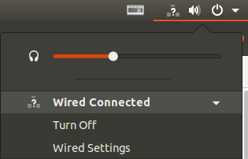
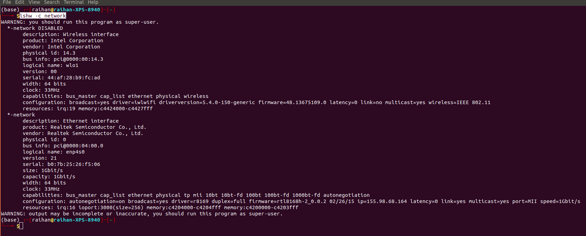
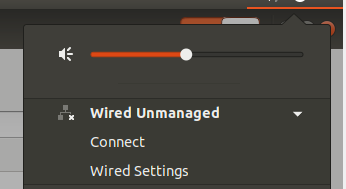
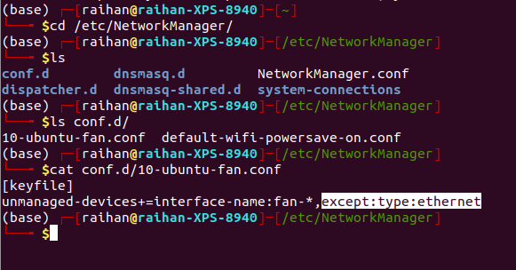
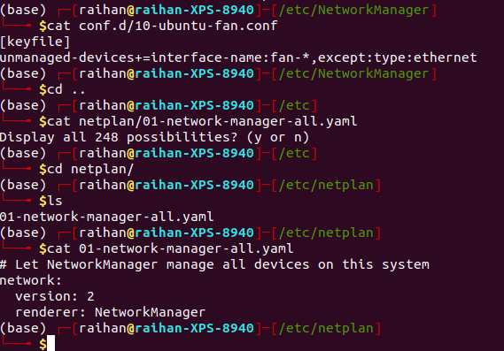
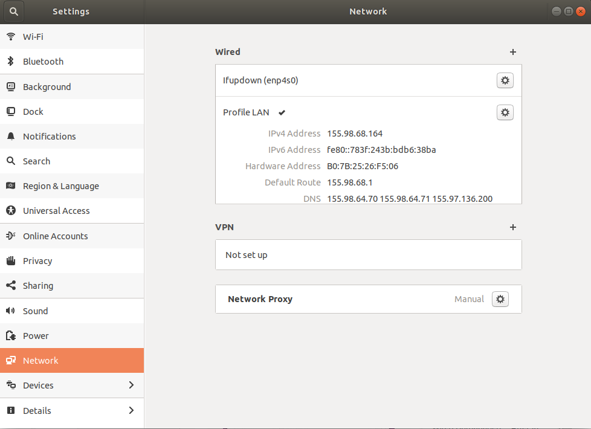
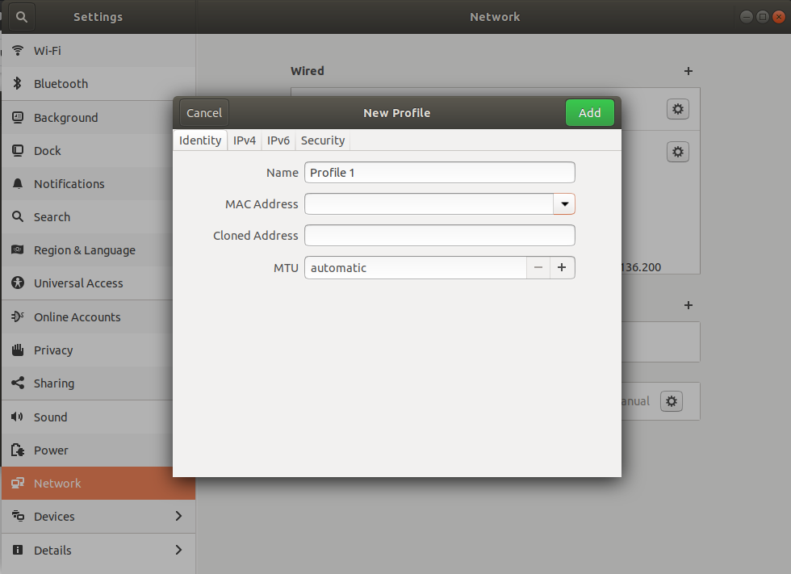
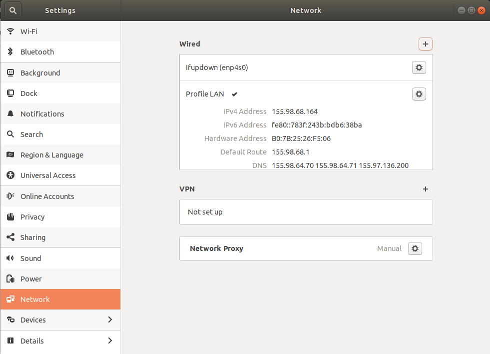

# Wired is not present
The wired connection you see in the pic is not present. 



Now, follow along,
1. First check if any ethernet port is up with this `lshw -c network`
Check if the eth is enabled or disabled. At first, the 2nd network which is enabled in the pic was disabled. 



2. Then I turned this up with this `sudo ifup enp4s0`
This command `sudo ip enp4s0 up` didn't work.

3. Now, restart network manager,
```
sudo service network-manager restart
```
It will be restarted but the network was unmanaged. 



4. Now, followed this question to solve the problem,
[No wired connection - Wired unmanaged ubuntu 18.04](https://askubuntu.com/questions/1039233/no-wired-connection-wired-unmanaged-ubuntu-18-04)

Went through each and every solution and checked if it is present in my case and added after understanding everything.

 - Added this part to `/etc/conf.d/10-ubuntu-fan.conf` following [this answer](https://askubuntu.com/a/1410733/1700007)
 

 - [This was already present](https://askubuntu.com/a/1094406/1700007)

 

 - Didn't need to create this `sudo touch /etc/NetworkManager/conf.d/10-globally-managed-devices.conf` as [shown in this answer](https://askubuntu.com/a/1043244/1700007)

Now, unmanaged should be gone and **RESTART** the PC. It should find the ethernet port. 

Here is how the network settings looks like. The wired will show up after the above steps are done. 

Created the `Profile LAN`. 



To create the `Profile LAN`, just click the plus `+` sign and click `MAC Address`, it will give the address. And don't change anything and click add then this enable the ethernet connection. 


The dns will not show up first, but it will show up eventually.



## History of commands
```
1929  sudo nmcli networkin off
 1930  sudo nmcli networking off
 1931  sudo nmcli networking on
 1932  sudo reboot
 1933  ifconfig -a
 1934  ifconfig
 1935  network-test
 1936  lshw -c network
 1937  ip link
 1938  ip s
 1939  ip a
 1940  sudo ip eth0 up
 1941  ip help
 1942  ip link
 1943  clear
 1944  lshw -c network
 1945  sudo ip enp4s0 up
 1946  sudo ifup enp4s0
 1947  lshw -c network
 1948  cat /etc/network/interfaces
 1949  lshw -c network
 1950  sudo ifup enx4ce173421f86
 1951  sudo ifup enp4s0
 1952  sudo ifup enx4ce173421f86
 1953  lshw -c network
 1954  clear
 1955  lshw -c network
 1956  clear
 1957  lshw -c network
 1958  sudo service network-manager restart
 1959  cd /etc/NetworkManager/
 1960  ls
 1961  clear
 1962  sudo nano /etc/NetworkManager/conf.d/10-globally-managed-devices.conf
 1963  cd conf.d/
 1964  ls
 1965  cat 10-ubuntu-fan.conf 
 1966  cat default-wifi-powersave-on.conf 
 1967  clear
 1968  sudo apt install network-manager
 1969  ls
 1970  cat 10-ubuntu-fan.conf 
 1971  cd ..
 1972  ls
 1973  cd netplan
 1974  clear
 1975  ls
 1976  nano 01-network-manager-all.yaml 
 1977  cd ..
 1978  cd NetworkManager/
 1979  ls
 1980  sudo nano NetworkManager.conf
 1981  cat NetworkManager.conf
 1982  cd conf.d
 1983  ls
 1984  cd ..
 1985  cd NetworkManager/
 1986  rg "managed"
 1987  clear
 1988  cd conf.d
 1989  ls
 1990  cat 10-ubuntu-fan.conf 
 1991  sudo nano 10-ubuntu-fan.conf 
 1992  clear
 1993  history
 1994  sudo service network-manager restart
 1995  clear
 1996  lshw -c network
 1997  ls
 1998  cd cheatsheets/
 1999  history
```
